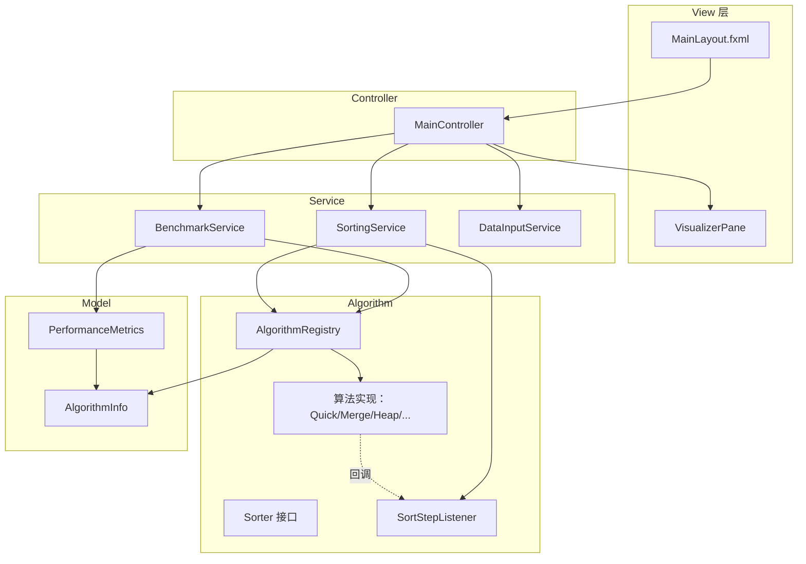
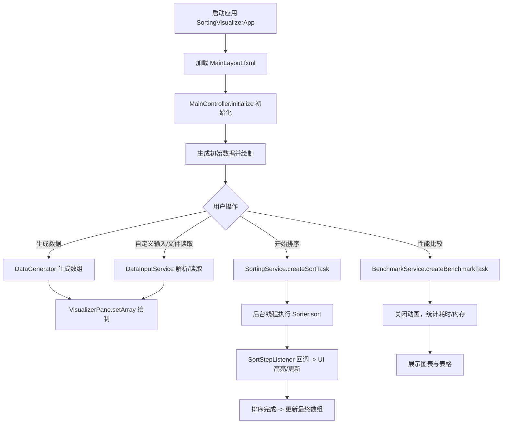
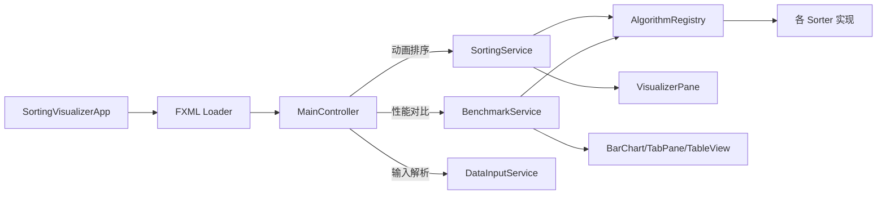
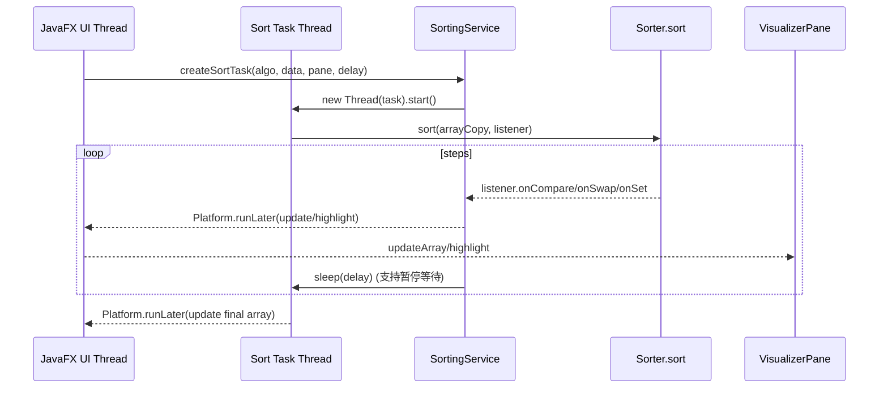

# 《数据结构与算法课程设计》

## 课程设计报告：排序算法性能比较与动画演示系统

项目名称：排序算法性能比较与动画演示系统

## 1．问题描述

排序算法是数据结构与算法课程的核心内容之一。不同排序算法在不同数据规模与数据分布下具有不同的效率特征，仅从理论复杂度往往难以直观感受到“比较/交换/覆盖”等关键步骤对运行过程的影响。

本课程设计实现一个桌面端“排序算法性能比较与动画演示系统”，系统能够：

### 1.1 基本要求

1. 存储结构与数据输入：使用数组存储待排序数据，支持生成数据与用户输入。
2. 排序算法实现：实现快速排序、归并排序、堆排序等多种排序算法，并保证排序正确。
3. 动画演示：能够一步一步展示排序过程中的关键操作（比较、交换/覆盖），帮助理解算法原理。
4. 性能比较：对不同算法在不同数据集上进行性能对比，展示耗时等指标。
5. 用户界面：提供友好界面，支持算法选择、数据输入/选择、结果展示。

### 1.2 提高要求

1. 支持更丰富的数据输入方式：自定义输入 + 文件读取（如 `.txt/.csv`）。
2. 产生并展示更多维度指标：包括内存占用估算、稳定性、复杂度元数据等。
3. 扩展更多排序算法与演示：在满足核心算法基础上，增加计数/基数/桶排序及演示型算法等，便于横向对比。
4. 交互增强：支持动画速度调节、暂停/继续等交互控制。

本系统已按 Maven + JavaFX 构建，采用 MVC 架构与策略模式/回调机制实现可扩展的算法注册与可视化。

## 2．需求分析

### 2.1 功能性需求

1. 数据存储与输入
   - 存储结构：使用 `int[]` 存储待排序数据。
    - 数据来源：生成数据（随机/有序/逆序/部分有序）、自定义输入（多分隔符）、文件输入（`.txt/.csv` 解析）。

2. 排序算法实现
   - 系统实现的算法（按注册表）：冒泡、快速、归并、堆、插入、选择、计数、桶、基数、猴子、睡眠、珠排序等。
   - 重点算法：快速排序、归并排序、堆排序（课程要求）。
   - 正确性：任意输入数组最终输出为非降序。
   - 稳定性：系统为每个算法提供“是否稳定”的元数据展示与对比（并非所有算法本身稳定）。

3. 动画演示
   - 能逐步展示：比较（高亮）、交换（交换高亮）、覆盖赋值（覆盖高亮）。
   - 支持速度调节与暂停/继续。

4. 性能比较
   - 在关闭动画回调的模式下运行算法，统计耗时与内存估算值。
   - 展示算法元信息：最佳/平均/最差时间复杂度、空间复杂度、稳定性。
   - 展示结果方式：柱状图（时间/内存）+ 表格（详细指标）。

5. 用户界面
   - 可选择算法/数据规模/数据类型。
   - 支持生成数据、开始排序、暂停/继续、性能比较。
   - 支持显示数值标签。

### 2.2 非功能性需求

1. 可维护性：模块职责清晰，算法可插拔添加。
2. 交互性：动画流畅，响应及时，耗时操作不阻塞 UI。
3. 可扩展性：新增算法只需实现接口并注册。

## 3．概要设计

### 3.1 开发环境与技术选型

- 语言：Java 17
- GUI：JavaFX 17（FXML + 控制器）
- 构建：Maven
- 并发：JavaFX `Task` + `Platform.runLater`

### 3.2 系统总体架构（MVC + 策略模式）
系统采用 MVC：

- View：`MainLayout.fxml` + `VisualizerPane`（负责绘制柱状图与高亮）
- Controller：`MainController`（处理按钮事件与界面状态）
- Model：`PerformanceMetrics`、`AlgorithmInfo` 等
- Service：`SortingService`（动画排序任务）、`BenchmarkService`（性能对比）、`DataInputService`（数据解析）

同时使用策略模式将“排序算法”抽象为接口：

- `Sorter`：统一排序入口
- `AlgorithmRegistry`：算法实例与元数据统一注册管理

图1：系统架构图（MVC + 服务层 + 算法策略）



### 3.3 抽象数据类型（ADT）说明

ADT：待排序数据（数组）

Data
- `int[] array`：待排序数组（可视化与排序操作对象）

Operation
- `generate(type, size)`：生成数据
- `parse(input)`：解析用户输入字符串为数组
- `load(file)`：从文件读取并解析
- `sort(algorithm, array, listener)`：执行排序

End ADT

ADT：排序步骤监听器（回调接口）

Data
- 无（以回调事件形式提供“步骤”）

Operation
- `onCompare(i, j)`：比较事件
- `onSwap(i, j)`：交换事件
- `onSet(i, value)`：覆盖赋值事件

End ADT

### 3.4 主程序流程
图2：主流程图



### 3.5 模块调用关系
图3：模块调用关系图



## 4．详细设计

### 4.1 用户界面设计（FXML）
界面由 [src/main/resources/org/example/sortingvisualizer/view/MainLayout.fxml] 定义，主要控件：

- 算法选择：`ComboBox algorithmComboBox`
- 数据量输入：`TextField dataSizeField`
- 数据类型选择：`ComboBox dataTypeComboBox`（随机/有序/逆序/部分有序）
- 操作按钮：生成数据、开始排序、暂停/继续、性能比较
- 自定义数据：输入框 + 显示数据 + 读取文件
- 动画速度：`Slider speedSlider`
- 状态栏：`Label statusLabel`

### 4.2 动画演示机制设计
本系统的动画不是使用 Timeline 逐帧“重算”，而是采用“算法执行 → 步骤回调 → UI 更新”的方式：

1. 排序算法在关键操作处调用 `SortStepListener`：
    - 比较：`onCompare(i, j)`
    - 交换：`onSwap(i, j)`
    - 覆盖赋值：`onSet(i, value)`（归并/计数/基数/桶排序等）

2. `SortingService` 在后台线程执行排序，并在回调中通过 `Platform.runLater` 安全更新 UI；同时使用 `Thread.sleep(delay)` 控制速度。

3. `VisualizerPane` 负责绘制柱状图：
    - 每个元素画为一个矩形柱，柱高按最大值归一化；
    - 比较/交换/赋值分别用颜色高亮（红/绿/蓝）。

图4：动画回调时序图



### 4.3 主要排序算法设计与实现要点

说明：系统中的算法均通过 `Sorter` 接口统一调用；并在 `AlgorithmRegistry` 中注册中文名称与复杂度/稳定性元数据。

#### 4.3.1 快速排序（Quick Sort）
实现方式：递归 + Lomuto 分区（以末尾元素为 pivot）。
- 比较事件：每次 `array[j]` 与 `pivot` 比较触发 `onCompare(j, high)`。
- 交换事件：每次交换触发 `onSwap(i, j)`。

核心流程（图5：快速排序流程图）

```mermaid
flowchart TD
    A[quickSort(low, high)] --> B{low < high?}
    B -- 否 --> Z[返回]
    B -- 是 --> C[partition 得到 pi]
    C --> D[递归 quickSort(low, pi-1)]
    D --> E[递归 quickSort(pi+1, high)]
    E --> Z
```

#### 4.3.2 归并排序（Merge Sort）
实现方式：递归二分 + 合并。
- 由于归并排序本质是“覆盖写回”，系统主要用 `onSet(k, value)` 展示写回过程；比较时也用近似索引高亮 `onCompare(l+i, m+1+j)`。

#### 4.3.3 堆排序（Heap Sort）
实现方式：先建大根堆，再逐步把堆顶与末尾交换，并对缩小的堆进行 `heapify`。
- 比较事件：在比较左右孩子与当前最大值时触发 `onCompare(child, largest)`。
- 交换事件：交换根与末尾、以及 heapify 交换时触发 `onSwap(i, largest)`。

#### 4.3.4 计数排序 / 基数排序
- 计数排序：统计频率 → 前缀和 → 输出数组 → 覆盖写回（用 `onSet` 展示）。
- 基数排序：对每一位执行“计数排序”（LSD）；当前实现中使用 `Arrays.fill` 清零计数数组。

#### 4.3.5 桶排序
桶排序步骤：

1. 扫描最大最小值
2. 初始化桶（桶数约为 $\sqrt{n}$）
3. 按区间将元素分配到桶
4. 桶内排序 + 合并回原数组

为了满足“不能使用内置排序”，桶内排序采用插入排序实现，并在桶内比较时触发 `onCompare`，合并写回时触发 `onSet`。

#### 4.3.6 扩展算法
系统还包含：
- 猴子排序（Bogo Sort）：随机打乱直到有序（仅演示，不适合性能对比）。
- 睡眠排序（Sleep Sort）：多线程睡眠后写回（仅演示，存在并发可视化上的非严格性）。
- 珠排序（Bead Sort）：重力下落模拟（仅适用于正整数，演示型算法）。

### 4.4 性能比较模块设计
性能比较由 `BenchmarkService` 提供：
- 在不传入监听器（`listener = null`）情况下运行排序，避免动画导致的额外开销。
- 时间测量：`System.nanoTime()` 前后差。
- 内存估算：调用 `System.gc()` 后，用 `Runtime.totalMemory() - freeMemory()` 估算排序前后差值（属于粗略估算）。
- 结果模型：`PerformanceMetrics`（record）包含耗时、内存、数据规模、数据集类型以及 `AlgorithmInfo` 元数据。
- UI 展示：时间柱状图、内存柱状图、详细表格（复杂度/稳定性等）。

图6：性能测试流程图

```mermaid
flowchart TD
    A[选择数据规模与类型] --> B[BenchmarkService 生成 baseArray]
    B --> C{遍历算法列表}
    C --> D[拷贝数组 arrayCopy]
    D --> E[GC + 记录 startMem]
    E --> F[记录 startTime]
    F --> G[sorter.sort(arrayCopy, null)]
    G --> H[记录 endTime/endMem]
    H --> I[计算 timeElapsed/memoryUsed]
    I --> J[封装 PerformanceMetrics]
    J --> C
    C -->|完成| K[Controller 展示 TabPane 图表/表格]
```

## 5．编码与调试分析

### 5.1 编码实现要点

1. UI 与耗时操作解耦：排序动画运行在后台线程，UI 更新通过 `Platform.runLater`。
2. 暂停/继续机制：使用 `paused`（volatile）+ `pauseLock` 实现“步骤级暂停”。
3. 算法解耦与扩展：新增算法只需实现 `Sorter` 并在 `AlgorithmRegistry` 注册。
4. 动画统一事件：比较/交换/覆盖三类事件覆盖大部分排序算法。

### 5.2 调试中遇到的问题与解决办法（结合实现）
【问题一】动画排序阻塞 UI
- 原因：若在 UI 线程进行排序或 sleep，会造成界面卡死。
- 解决：在 `SortingService` 内使用 JavaFX `Task` 在后台线程执行，UI 更新全部通过 `Platform.runLater`。

【问题二】非交换型算法的可视化
- 原因：归并/计数/基数等算法主要是“覆盖写回”，没有交换步骤。
- 解决：统一使用 `onSet(index, value)` 作为写回事件，UI 用蓝色高亮显示赋值位置。

【问题三】桶排序桶内排序不能用内置 API
- 解决：桶内使用插入排序替代，并确保监听器事件合理触发。

### 5.3 可改进点（保留为后续优化方向）

1. 性能测试数据类型字符串一致性：界面使用“逆序数据”，而性能模块的 switch 中存在“递序数据”分支字符串（建议统一为“逆序数据”）。
2. 内存测量属于估算值：GC 与运行时内存波动会影响结果，可采用多次取平均或使用更严格的基准测试框架（如 JMH）作为扩展。
3. 睡眠排序/猴子排序等演示型算法不适合做大规模 benchmark，目前系统已在性能比较中剔除部分算法。

## 6．使用说明

1. 运行项目
    - Maven 编译：`mvn clean compile`
    - 启动程序：`mvn javafx:run`

2. 基本操作
    - 选择排序算法与数据类型，输入数据量，点击“生成数据”。
    - 点击“开始排序”观察动画过程。
    - 使用“动画速度”滑块调节速度；点击“暂停/继续”控制演示。

3. 自定义数据与文件加载
    - 在“自定义数据”中输入例如：`3, 1, 4, 1, 5`，点击“显示数据”。
    - 点击“读取文件”选择 `.txt/.csv`，文件内容支持多行与多种分隔符。

4. 性能比较
    - 点击“性能比较”，系统将运行选定规模与数据类型下的多算法测试，并展示时间/内存柱状图及详细表格。

## 7．测试结果

说明：以下运行截图由作者提供；流程图/结构图由报告自动生成（Mermaid）。

（1）程序运行界面截图
- 图7：主界面与动画演示截图（作者提供）
- 图8：暂停/继续与速度调节截图（作者提供）

（2）性能比较结果截图
- 图9：时间对比柱状图截图（作者提供）
- 图10：内存对比柱状图截图（作者提供）
- 图11：详细数据表截图（作者提供）

（3）不同数据集对比截图（可选）
- 图12：随机/有序/逆序/部分有序对比截图（作者提供）

## 8．团队协作与自学内容
在课程设计中，重点学习与实践内容包括：

1. JavaFX：FXML 组件布局、控制器绑定、线程模型（UI Thread 与后台线程协作）。
2. 设计模式：策略模式（算法可插拔）、MVC 分层、回调式观察者机制。
3. 多线程与同步：暂停/继续的等待-通知模型，避免 UI 阻塞。
4. 排序算法：快速/归并/堆等算法的实现细节与可视化表达；稳定性与复杂度的理解。

## 参考资料
1) 《数据结构（C语言版/Java版）》相关教材
2) JavaFX 官方文档（Controls/FXML/Concurrency）
3) 《算法导论》排序章节（复杂度与性质）

## 项目实施进度管理表（示例，可按实际日期填写）

项目名称：排序算法性能比较与动画演示系统

| 阶段 | 时间安排 | 实施内容 | 完成情况及呈现形式 |
|---|---|---|---|
| 1 | 第1周 | 需求分析、架构设计、界面原型 | 完成 FXML + MVC 骨架 |
| 2 | 第2周 | 集成并实现核心算法（快/归/堆等）与动画回调 | 可视化演示可运行 |
| 3 | 第3周 | 性能比较模块与图表展示、输入/文件加载 | 对比结果可视化输出 |
| 4 | 第4周 | 调试优化、完善文档与报告 | 可提交版本 |

