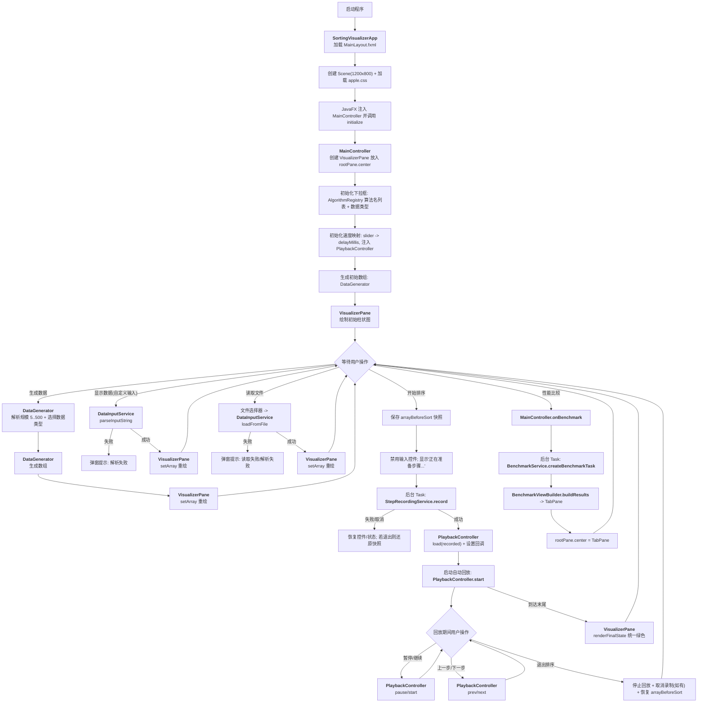
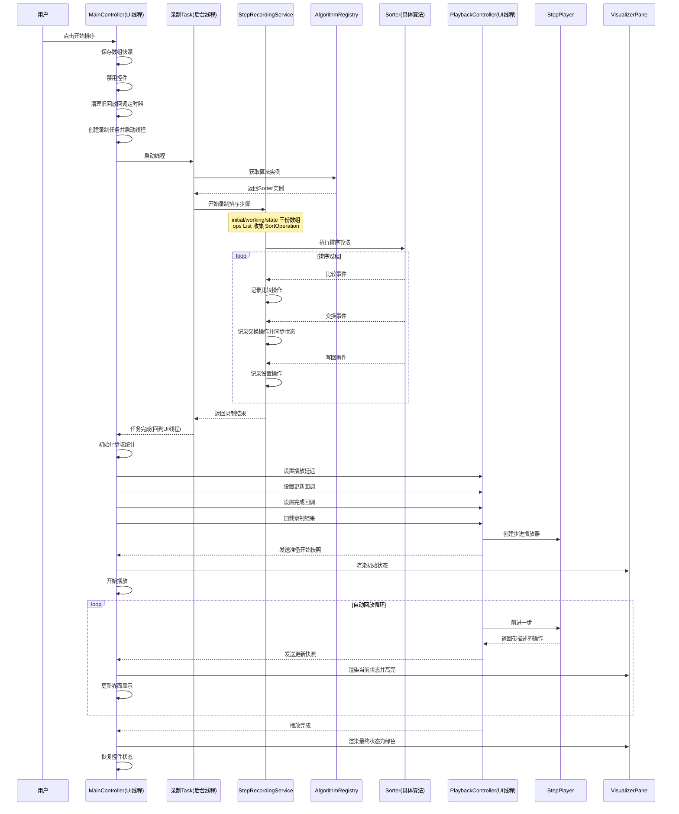
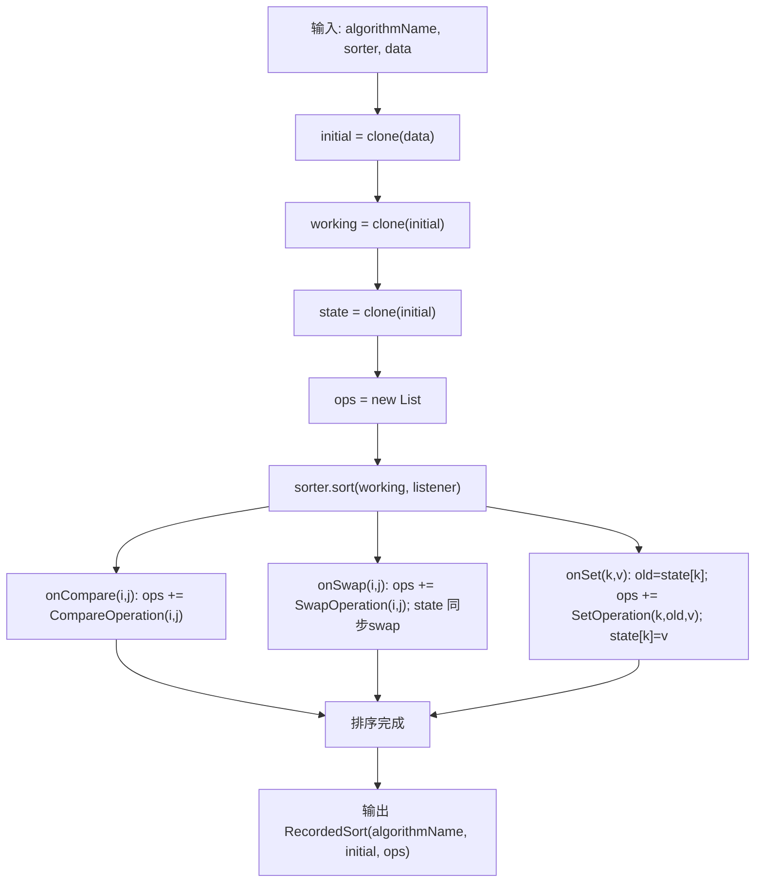
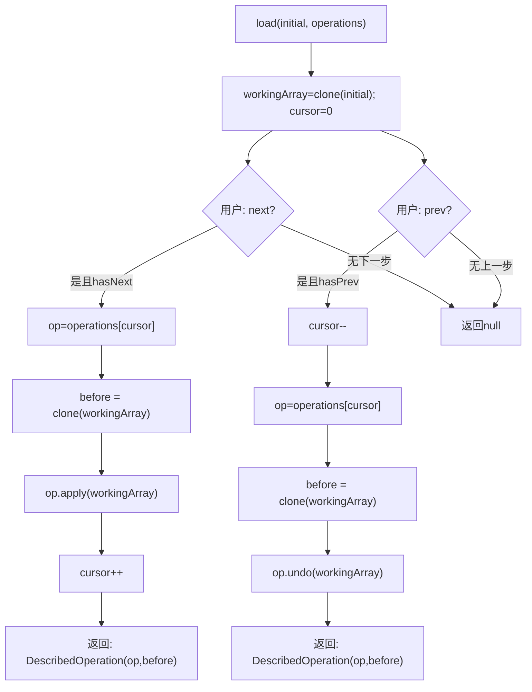
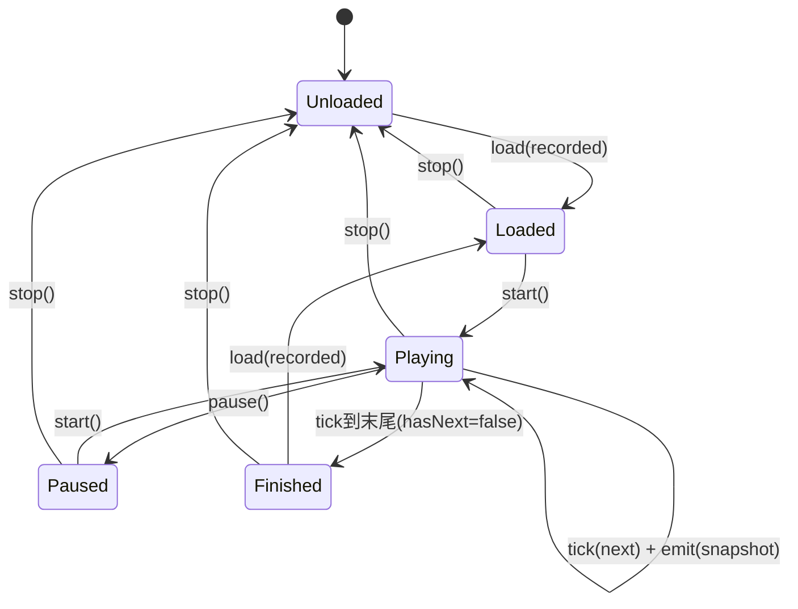
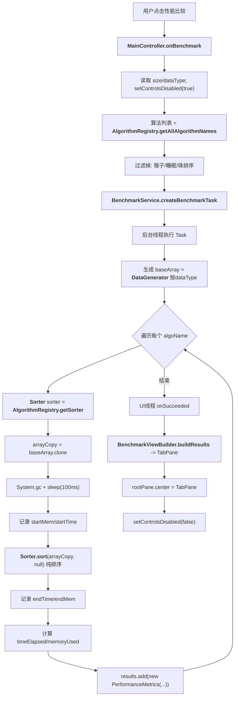

# 排序算法可视化系统：全过程流程图（对齐当前代码实现）

日期：2025-12-29

> 本文基于当前仓库的实际代码与文档：
>
> - 
>
>   [SortingVisualizerApp.java](https://tencent.yuanbao/src/main/java/org/example/sortingvisualizer/SortingVisualizerApp.java)
>
> - 
>
>   [MainLayout.fxml](https://tencent.yuanbao/src/main/resources/org/example/sortingvisualizer/view/MainLayout.fxml)
>
> - 
>
>   [MainController.java](https://tencent.yuanbao/src/main/java/org/example/sortingvisualizer/controller/MainController.java)
>
> - 
>
>   [StepRecordingService.java](https://tencent.yuanbao/src/main/java/org/example/sortingvisualizer/service/StepRecordingService.java)
>
> - 
>
>   [PlaybackController.java](https://tencent.yuanbao/src/main/java/org/example/sortingvisualizer/playback/PlaybackController.java)
>
> - 
>
>   [StepPlayer.java](https://tencent.yuanbao/src/main/java/org/example/sortingvisualizer/step/StepPlayer.java)
>
> - 
>
>   [VisualizerPane.java](https://tencent.yuanbao/src/main/java/org/example/sortingvisualizer/view/VisualizerPane.java)
>
> - 
>
>   [BenchmarkService.java](https://tencent.yuanbao/src/main/java/org/example/sortingvisualizer/service/BenchmarkService.java)
>
> - 
>
>   [BenchmarkViewBuilder.java](https://tencent.yuanbao/src/main/java/org/example/sortingvisualizer/view/BenchmarkViewBuilder.java)
>
> - 
>
>   文档：[操作整理_新增步进与界面美化.md](https://tencent.yuanbao/操作整理_新增步进与界面美化.md)、[总报告*对齐现状版*20251226.md](https://tencent.yuanbao/总报告_对齐现状版_20251226.md)

------

## 1. 模块清单（含"做了什么"）

### 应用入口

- 

  [SortingVisualizerApp](https://tencent.yuanbao/src/main/java/org/example/sortingvisualizer/SortingVisualizerApp.java)：加载 FXML、创建 Scene、注入 Apple 风格 CSS、展示 Stage。

### 视图布局（FXML）

- 

  [MainLayout.fxml](https://tencent.yuanbao/src/main/resources/org/example/sortingvisualizer/view/MainLayout.fxml)：定义顶部控件区（算法/数据/速度/按钮/统计/回显）与中心区域（放置 [VisualizerPane](https://tencent.yuanbao/src/main/java/org/example/sortingvisualizer/view/VisualizerPane.java)或 benchmark TabPane）。

### 控制器（流程编排器）

- 

  [MainController](https://tencent.yuanbao/src/main/java/org/example/sortingvisualizer/controller/MainController.java)：

  - 

    解析用户输入（规模/类型/自定义/文件）并更新可视化

  - 

    启动"录制任务"（后台）并在完成后启动"回放"（UI 定时）

  - 

    处理暂停/继续/上一步/下一步/退出排序

  - 

    发起"性能比较"后台任务并展示结果视图

### 算法注册与算法实现

- 

  [AlgorithmRegistry](https://tencent.yuanbao/src/main/java/org/example/sortingvisualizer/algorithm/AlgorithmRegistry.java)：管理"中文算法名 → Sorter实例 / AlgorithmInfo元数据"的映射。

- 

  [Sorter](https://tencent.yuanbao/src/main/java/org/example/sortingvisualizer/algorithm/Sorter.java)（接口）+ 具体实现：对数组排序；可选地通过 [SortStepListener](https://tencent.yuanbao/src/main/java/org/example/sortingvisualizer/algorithm/SortStepListener.java)回调关键事件。

- 

  [SortStepListener](https://tencent.yuanbao/src/main/java/org/example/sortingvisualizer/algorithm/SortStepListener.java)：三类事件：比较（COMPARE）/交换（SWAP）/写回（SET）。

### 步骤系统（录制→回放/撤销）

- 

  [StepRecordingService](https://tencent.yuanbao/src/main/java/org/example/sortingvisualizer/service/StepRecordingService.java)：把算法回调转换为可回放/可撤销的 [SortOperation](https://tencent.yuanbao/src/main/java/org/example/sortingvisualizer/step/SortOperation.java)列表，产出 [RecordedSort](https://tencent.yuanbao/src/main/java/org/example/sortingvisualizer/playback/PlaybackSnapshot.java)。

- 

  [RecordedSort](https://tencent.yuanbao/src/main/java/org/example/sortingvisualizer/playback/PlaybackSnapshot.java)：一次录制结果（algorithmName、initialArray、operations）。

- 

  [SortOperation](https://tencent.yuanbao/src/main/java/org/example/sortingvisualizer/step/SortOperation.java)/[SortOperationType](https://tencent.yuanbao/src/main/java/org/example/sortingvisualizer/step/SortOperationType.java)：统一的 apply/undo + 描述文本。

- 

  [CompareOperation](https://tencent.yuanbao/src/main/java/org/example/sortingvisualizer/step/CompareOperation.java)/[SwapOperation](https://tencent.yuanbao/src/main/java/org/example/sortingvisualizer/step/SwapOperation.java)/[SetOperation](https://tencent.yuanbao/src/main/java/org/example/sortingvisualizer/step/SetOperation.java)：三类具体操作（支持撤销）。

- 

  [StepPlayer](https://tencent.yuanbao/src/main/java/org/example/sortingvisualizer/step/StepPlayer.java)：维护工作数组与 cursor，提供 next/prev（前进与撤销），并产出"可回显的操作描述"。

### 回放控制

- 

  [PlaybackController](https://tencent.yuanbao/src/main/java/org/example/sortingvisualizer/playback/PlaybackController.java)：封装 [StepPlayer](https://tencent.yuanbao/src/main/java/org/example/sortingvisualizer/step/StepPlayer.java)+ JavaFX [PauseTransition](https://docs.oracle.com/javase/8/javafx/api/javafx/animation/PauseTransition.html)定时推进，向外发布 [PlaybackSnapshot](https://tencent.yuanbao/src/main/java/org/example/sortingvisualizer/playback/PlaybackSnapshot.java)。

- 

  [PlaybackSnapshot](https://tencent.yuanbao/src/main/java/org/example/sortingvisualizer/playback/PlaybackSnapshot.java)：一次更新快照（state/operation/cursor/size/hasPrev/hasNext/playing）。

### 可视化

- 

  [VisualizerPane](https://tencent.yuanbao/src/main/java/org/example/sortingvisualizer/view/VisualizerPane.java)：绘制柱状图；支持 renderState 高亮与 renderFinalState 完成态统一绿色；可显示数值标签。

### 数据服务

- 

  [DataGenerator](https://tencent.yuanbao/src/main/java/org/example/sortingvisualizer/util/DataGenerator.java)：生成随机/有序/逆序/部分有序数据。

- 

  [DataInputService](https://tencent.yuanbao/src/main/java/org/example/sortingvisualizer/service/DataInputService.java)：解析自定义输入字符串与文件内容为 `int[]`。

### 性能比较

- 

  [BenchmarkService](https://tencent.yuanbao/src/main/java/org/example/sortingvisualizer/service/BenchmarkService.java)：后台批量执行排序（不启用监听器），统计耗时与内存估算，输出 [PerformanceMetrics](https://tencent.yuanbao/src/main/java/org/example/sortingvisualizer/model/PerformanceMetrics.java)列表。

- 

  [BenchmarkViewBuilder](https://tencent.yuanbao/src/main/java/org/example/sortingvisualizer/view/BenchmarkViewBuilder.java)：把 metrics 渲染为 TabPane（摘要/时间/内存/表格），并给柱状图柱子安装 Tooltip。

------

## 2. 全局"用户视角"总流程图（从启动到结束）

------

## 3. "开始排序"详细流程（录制→回放，含线程边界）

### 3.1 时序图：从点击"开始排序"到自动回放

### 3.2 录制阶段内部流程（StepRecordingService.record）

### 3.3 回放/撤销阶段内部流程（StepPlayer）

------

## 4. 回放控制状态机（PlaybackController）

"tick"由 JavaFX [PauseTransition](https://docs.oracle.com/javase/8/javafx/api/javafx/animation/PauseTransition.html)实现：每次到点执行一次 `next()`，若仍有下一步就重新 schedule。

------

## 5. 可视化刷新与回显/统计更新（UI线程）

### 5.1 高亮与完成态

- 

  回放每一步：

  - 

    [MainController.updateStepUi](https://tencent.yuanbao/src/main/java/org/example/sortingvisualizer/controller/MainController.java#L340-L350)调用 [VisualizerPane.renderState](https://tencent.yuanbao/src/main/java/org/example/sortingvisualizer/view/VisualizerPane.java#L80-L90)(state, op.index1, op.index2, highlightColor)

  - 

    高亮色由 [SortOperationType](https://tencent.yuanbao/src/main/java/org/example/sortingvisualizer/step/SortOperationType.java)映射：COMPARE 红 / SWAP 绿 / SET 蓝

- 

  回放到末尾：

  - 

    [MainController.onPlaybackFinished](https://tencent.yuanbao/src/main/java/org/example/sortingvisualizer/controller/MainController.java#L352-L360)调用 [VisualizerPane.renderFinalState](https://tencent.yuanbao/src/main/java/org/example/sortingvisualizer/view/VisualizerPane.java#L92-L100)(state, 绿色)

### 5.2 操作回显（"本步做了什么"）

- 

  [StepPlayer.next/prev](https://tencent.yuanbao/src/main/java/org/example/sortingvisualizer/step/StepPlayer.java)会把"执行前数组快照"封装进 [DescribedOperation](https://tencent.yuanbao/src/main/java/org/example/sortingvisualizer/step/RecordedSort.java)

- 

  [MainController.updateStepUi](https://tencent.yuanbao/src/main/java/org/example/sortingvisualizer/controller/MainController.java#L340-L350)调用 `op.description(null)`（参数会被忽略，实际使用"执行前快照"）

- 

  典型回显：

  - 

    [CompareOperation](https://tencent.yuanbao/src/main/java/org/example/sortingvisualizer/step/CompareOperation.java): 比较 a[i]=? 与 a[j]=?

  - 

    [SwapOperation](https://tencent.yuanbao/src/main/java/org/example/sortingvisualizer/step/SwapOperation.java): 交换 a[i]=? 与 a[j]=?

  - 

    [SetOperation](https://tencent.yuanbao/src/main/java/org/example/sortingvisualizer/step/SetOperation.java): 设置 a[k] old -> new

### 5.3 步骤统计（比较/交换/写回 当前/总）

- 

  录制完成后：[MainController.initOperationStats](https://tencent.yuanbao/src/main/java/org/example/sortingvisualizer/controller/MainController.java#L280-L290)(operations) 生成 prefix 数组（长度 = steps+1）

- 

  回放每次更新：读取 `prefix[cursor]`与 `prefix[total]`

- 

  特殊：算法名为"猴子排序"时 `suppressStepStats=true`，统计栏显示 `-/-`，避免额外开销与体验问题

------

## 6. 性能比较（Benchmark）全过程

### 6.1 总流程图

### 6.2 结果展示内容

- 

  摘要 Tab：数据类型、n、参与算法数；最快/最慢/平均/中位数；内存最小/最大。

- 

  时间对比/内存对比：BarChart；每个柱子安装 Tooltip 显示 `ms/MB`。

- 

  详细数据：TableView 展示算法名、耗时、平均复杂度、空间复杂度、稳定性。

------

## 7. "旧的实时回调动画"路径说明（当前代码中未被主流程使用）

仓库里仍保留了一个 [SortingService](https://tencent.yuanbao/src/main/java/org/example/sortingvisualizer/service/SortingService.java)（实时执行 + listener 回调 UI）实现。

但在当前 [MainController](https://tencent.yuanbao/src/main/java/org/example/sortingvisualizer/controller/MainController.java)的主流程中：

- 

  排序演示使用的是"录制→回放/撤销"路径（[StepRecordingService](https://tencent.yuanbao/src/main/java/org/example/sortingvisualizer/service/StepRecordingService.java)+ [PlaybackController](https://tencent.yuanbao/src/main/java/org/example/sortingvisualizer/playback/PlaybackController.java)），

- 

  [SortingService](https://tencent.yuanbao/src/main/java/org/example/sortingvisualizer/service/SortingService.java)没有被 new 或调用（搜索仅命中其自身定义与一处注释）。

保留它的价值更像"历史实现/备选实现"，但它天然难以支持可靠的"上一步"（不可逆）。