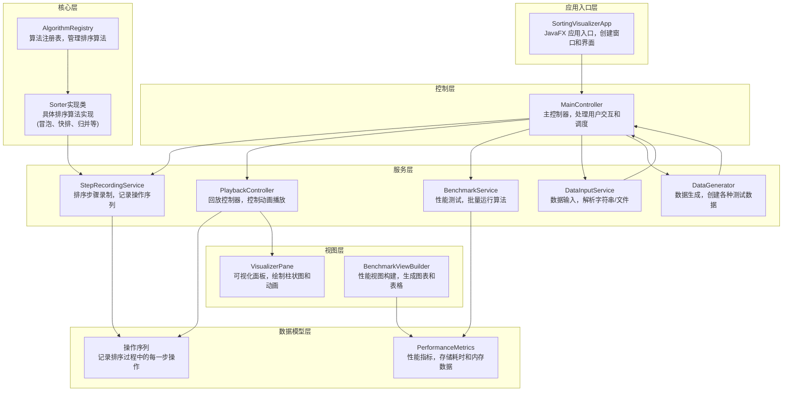
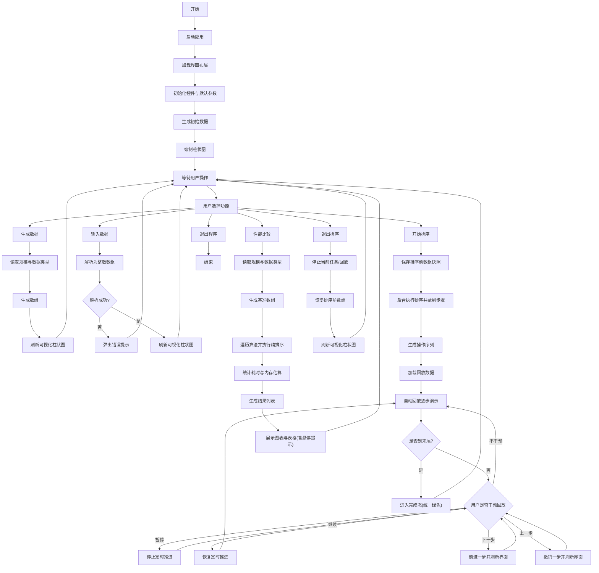
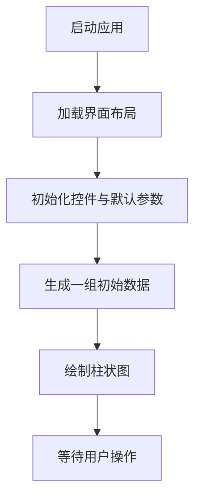
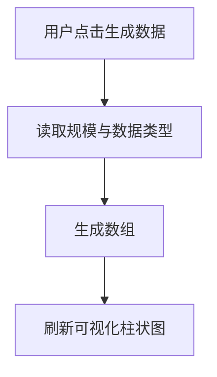
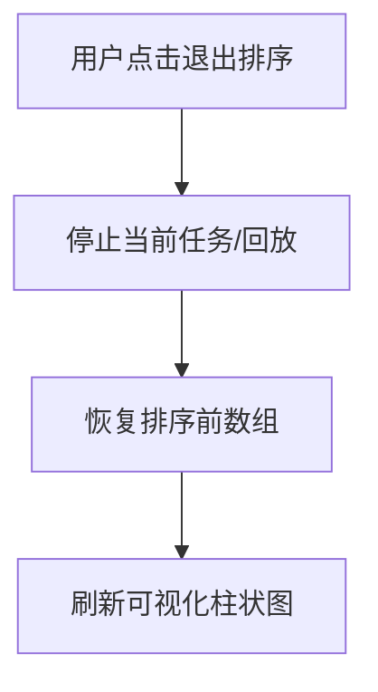
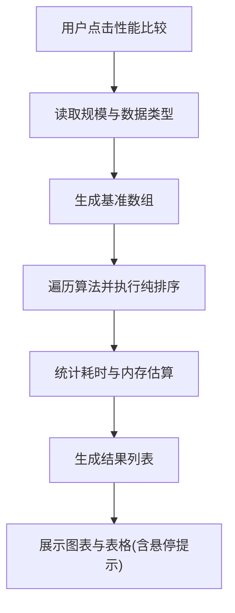

# 1 问题描述

排序算法是数据结构与算法课程的核心内容之一。不同排序算法在不同数据规模与数据分布下具有不同的效率特征，仅从理论复杂度往往难以直观感受到“比较/交换/写回”等关键步骤对运行过程的影响。本课程设计实现一个桌面端“排序算法性能比较与动画演示系统”。

该系统实现以下功能：

1）使用数组存储待排序数据，支持生成数据、自定义输入及文件读取（如 .txt/.csv）。

2）支持多种排序算法（如快速排序、归并排序、堆排序、计数排序、基数排序、桶排序等），并保证排序正确性。

3）逐步展示排序过程中的关键操作（比较、交换、写回），通过动画演示帮助理解算法原理；支持“上一步/下一步/暂停/继续”，并在界面中回显“本步做了什么操作”。

4）对不同算法在同一数据集上进行性能对比，展示耗时、内存占用估算、稳定性、复杂度等指标，并以图表与表格输出；图表柱子支持悬停提示（ms/MB）。

5）提供友好界面，支持算法选择、数据输入/选择、结果展示，并支持动画速度调节、退出排序（恢复到排序前数据）等交互控制。

---

# 2 需求分析

系统的基本功能如下。

## 2.1 数据准备

支持三种数据来源：

（a）生成数据：支持“随机数据 / 有序数据 / 逆序数据 / 部分有序”四种类型；数据量在界面输入框中给出，系统会限制范围为 5~500；默认数据量为 20。

（b）自定义输入：在“自定义数据”文本框输入整数序列，支持空格/逗号/分号/制表符/换行等分隔符。

（c）文件读取：通过文件选择器加载 .txt/.csv 文件，读取内容后按同一解析规则转为数组。

## 2.2 动画排序（录制→回放）

用户选择算法后点击“开始排序”，系统采用“两阶段”实现动画演示：

1）录制阶段：在后台线程执行排序算法，但不直接驱动 UI 动画；系统把排序中的关键事件（比较/交换/写回）记录为“可回放的操作序列”。

2）回放阶段：在 UI 线程中按一定节奏逐步回放操作序列，驱动柱状图更新；支持以下交互：

- 速度调节：滑块控制回放节奏（每一步的延迟）。
- 暂停/继续：暂停或恢复自动回放。
- 上一步/下一步：对操作序列进行撤销/前进，实现逐步讲解。
- 操作回显：显示“当前一步做了什么”（例如比较哪两个位置、交换哪两个位置、写回哪个位置）。
- 步骤统计：显示比较/交换/写回的“当前/总次数”。
- 排序完成态：当回放到末尾时，柱子统一显示为绿色，表示完成。

说明：为避免演示型极端算法导致步骤爆炸（例如猴子排序），系统对其在较大规模下进行保护性限制，避免程序异常。

## 2.3 性能比较

点击“性能比较”后，对多种算法在同一数据集上进行基准测试：

- 测试执行为“纯排序”，不启用动画回调与回放机制，以获得更可信的算法耗时。
- 输出包括：耗时、内存占用估算、算法复杂度与稳定性等元数据。
- 展示形式：时间对比柱状图、内存对比柱状图（估算）、详细数据表；图表柱子支持悬停提示（ms/MB）。
- 程序会自动排除不适合做性能测试的演示型算法（猴子排序、睡眠排序、珠排序）。

## 2.4 输入形式

1）生成数据：在界面输入“数据量”，选择“数据类型”，点击“生成数据”。

2）自定义输入：在“自定义数据”文本框输入一串整数（例如：3,1,4,1,5），点击“显示数据”。

3）文件读取：点击“读取文件”，选择 .txt/.csv 文件。

## 2.5 输出形式

1）动画演示输出：中间区域以柱状图形式显示数组；比较/交换/写回过程以不同颜色高亮显示；支持步骤计数、操作回显与次数统计；完成态统一绿色。

2）性能比较输出：时间对比柱状图、内存对比柱状图（估算）、详细数据表（复杂度/稳定性等），并支持图表悬停提示。

## 2.6 测试数据要求

1）生成数据：程序生成的数据为正整数序列（值域为 1~size）。

2）自定义/文件输入：需为可解析的整数序列；为了保证可视化柱状图显示效果，建议使用非负整数（输入负数可能导致柱高显示不直观）。

---

# 3 概要设计

## 3.1 抽象数据类型

### ADT 1：待排序数据（数组）

Data

- 以 `int[]` 表示待排序数据。

Operation

- 生成数据
  - 前置条件：用户已输入数据量、选择数据类型
  - 输入：规模、类型
  - 功能：生成随机/有序/逆序/部分有序数组
  - 输出：`int[]`
  - 后置条件：数组在界面中以柱状图显示

- 解析输入字符串
  - 前置条件：用户已输入自定义字符串
  - 输入：字符串
  - 功能：按多分隔符解析为整数数组
  - 输出：`int[]`
  - 后置条件：数组在界面中以柱状图显示

- 从文件加载
  - 前置条件：用户已选择文件
  - 输入：文件
  - 功能：读取文件内容并解析为整数数组
  - 输出：`int[]`
  - 后置条件：数组在界面中以柱状图显示

End ADT

### ADT 2：排序步骤记录与回放（录制→回放/撤销）

Data

- 初始数组（用于回放起点）
- 操作序列（每一步代表“比较/交换/写回”等关键操作）
- 游标（表示当前回放进度）
- 播放状态（自动回放中 / 已暂停）

Operation

- 加载回放数据
  - 前置条件：录制阶段已完成并生成操作序列
  - 输入：初始数组、操作序列
  - 输出：无
  - 后置条件：界面显示“准备开始”，可进行回放

- 下一步 / 上一步
  - 功能：前进或撤销一步
  - 后置条件：柱状图更新；操作回显更新；统计更新

- 开始 / 暂停 / 停止
  - 功能：控制自动回放节奏
  - 后置条件：自动回放进入/退出定时推进；停止后释放回放状态

- 完成态处理
  - 前置条件：回放进度到达末尾
  - 功能：进入完成态
  - 后置条件：柱子统一绿色显示

End ADT

## 3.2 模块调用关系

系统采用“分层 + 松耦合”的结构，各层职责如下。

应用入口层

- SortingVisualizerApp：JavaFX 应用入口，负责创建窗口、加载界面并显示。

控制层

- MainController：主控制器，负责用户交互、输入校验、任务启动与视图切换；不实现排序算法。

服务层

- StepRecordingService：步骤录制服务；在后台线程执行排序算法，并把关键事件记录为可回放操作序列。
- PlaybackController：回放控制器；负责自动回放定时、上一步/下一步/暂停/继续等控制，并向控制层输出回放快照。
- BenchmarkService：性能基准测试服务；批量运行算法，统计耗时与内存估算。
- DataInputService：数据输入服务；解析自定义输入字符串与文件内容。
- DataGenerator：数据生成器；生成随机/有序/逆序/部分有序数据。

核心层

- AlgorithmRegistry：算法注册表；管理算法实例与元数据，提供算法查找与列表。
- Sorter 实现类：各具体排序算法实现。

数据模型层

- AlgorithmInfo：算法元数据（复杂度、稳定性等）。
- PerformanceMetrics：性能测试输出（耗时、内存估算、元数据等）。

视图层

- VisualizerPane：可视化面板；负责绘制柱状图，支持高亮、标签、完成态统一绿色。
- BenchmarkViewBuilder：性能比较结果视图构建；负责构建图表与表格，并为图表柱子提供悬停提示。

模块调用关系图（使用流程图表达，不出现函数名）：



## 3.3 主程序流程

### 3.3.0 总流程图（包含开始/结束）



### 3.3.1 应用初始化流程



### 3.3.2 用户交互处理流程

#### （1）生成数据



#### （2）显示自定义数据 / 文件数据

```mermaid
flowchart TD
  A["用户提供输入"] --> B["解析为整数数组"]
  B --> C{ "解析成功?" }
  C -->|"否"| D["弹出错误提示"]
  C -->|"是"| E["刷新可视化柱状图"]
```

#### （3）开始排序（录制→回放）

```mermaid
flowchart TD
  A["用户点击开始排序"] --> B["保存排序前数组快照"]
  B --> C["后台执行排序并录制步骤"]
  C --> D["生成操作序列"]
  D --> E["加载回放数据"]
  E --> F["自动回放逐步演示"]
  F --> G{ "是否到末尾?" }
  G -->|"否"| F
  G -->|"是"| H["进入完成态(统一绿色)"]
```

#### （4）回放控制（暂停/继续/上一步/下一步）

```mermaid
flowchart TD
  A["回放已加载"] --> B{ "用户操作" }
  B -->|"暂停"| C["停止定时推进"]
  B -->|"继续"| D["恢复定时推进"]
  B -->|"下一步"| E["前进一步并刷新界面"]
  B -->|"上一步"| F["撤销一步并刷新界面"]
```

#### （5）退出排序（恢复到排序前）



#### （6）性能比较


