# 《数据结构与算法课程设计》

## 补充文档：第4章详细设计 + 第5章编码与调试分析（扩充版）

说明：本文档用于替换/补充课程设计报告中的“4．详细设计”和“5、编码与调试分析”。内容严格依据本项目源码（Java 17 + JavaFX + Maven）撰写，并按你给的示例写法组织：先给出“数据类型/结构”，再对“主程序与主要模块算法”逐个描述；每个模块均配套流程图（Mermaid）。

---

## 4．详细设计

### （1）实现概要设计的数据类型（对应代码结构）

本系统采用 MVC + Service 分层 + 策略模式组织代码。关键数据类型包括：待排序数组、排序步骤监听器、算法元数据、性能测试结果、可视化面板状态等。

#### 1）排序算法接口（Sorter）

`Sorter` 是策略接口，所有算法实现类（Quick/Merge/Heap/Counting/Radix/Bucket 等）均实现该接口。

```java
public interface Sorter {
  void sort(int[] array, SortStepListener listener);
  String getName();
}
```

- 数据域：无（接口）
- 操作：`sort` 为统一入口；当 `listener == null` 时只执行排序逻辑（用于性能比较），当 `listener != null` 时通过回调驱动动画。

#### 2）排序步骤监听器（SortStepListener）

`SortStepListener` 用于把算法“关键步骤”上报给 UI 层，实现动画。

```java
public interface SortStepListener {
  void onCompare(int index1, int index2);
  void onSwap(int index1, int index2);
  void onSet(int index, int value);
}
```

- `onCompare`：比较事件（UI 红色高亮）
- `onSwap`：交换事件（UI 更新数组并绿色高亮）
- `onSet`：覆盖写回事件（UI 更新数组并蓝色高亮）

#### 3）算法元数据（AlgorithmInfo）

`AlgorithmInfo` 记录算法名称与复杂度/稳定性等元信息，并在“详细数据表”中展示。

```java
public record AlgorithmInfo(
  String name,
  String bestTimeComplexity,
  String averageTimeComplexity,
  String worstTimeComplexity,
  String spaceComplexity,
  boolean isStable
) {}
```

#### 4）性能测试结果（PerformanceMetrics）

`PerformanceMetrics` 记录一次基准测试的结果，并提供单位换算方法。

```java
public record PerformanceMetrics(
  String algorithmName,
  String datasetType,
  int dataSize,
  long timeElapsedNanos,
  long memoryUsageBytes,
  AlgorithmInfo algorithmInfo
) {
  public double getTimeElapsedMillis() { ... }
  public double getMemoryUsageMB() { ... }
}
```

#### 5）算法注册表（AlgorithmRegistry）

注册表用 `LinkedHashMap` 保存算法实例与元数据，保证展示顺序稳定。

- `Map<String, Sorter> sorters`：中文名 → 算法实例
- `Map<String, AlgorithmInfo> metadata`：中文名 → 元数据

注册动作统一通过 `register(sorter, info)` 完成。

#### 6）可视化面板状态（VisualizerPane）

`VisualizerPane` 维护当前数组拷贝与显示开关：

- `int[] array`：面板内部保存的数组拷贝（保护性拷贝，避免外部修改导致不同步）
- `boolean showLabels`：是否显示数值标签
- 常量：柱间距、颜色、上下内边距

绘制时根据 `maxVal` 做归一化，将数组绘制成柱状图，并通过 `highlight(idx1, idx2, color)` 进行颜色高亮。

---

### （2）主程序以及主要模块的算法描述（含流程图）

本节按照“主程序 → 控制器 → 服务层 → 视图层 → 算法层”的调用方向，逐个说明主要模块的算法流程、关键数据与与可视化回调点。

---

#### ① 主程序入口（SortingVisualizerApp）

功能：加载 FXML 并启动 JavaFX 窗口。

核心步骤：

1. `FXMLLoader` 使用资源路径加载 `MainLayout.fxml`
2. 创建 `Scene` 并设置给 `Stage`
3. 设置标题并 `show()`

图1：主程序启动流程图

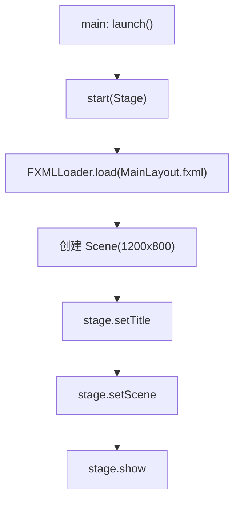

---

#### ② 控制器（MainController）：界面事件与状态管理

功能：响应按钮事件（生成数据/开始排序/暂停继续/性能比较/显示自定义数据/读取文件），并根据运行状态启用/禁用控件。

关键状态字段：

- `int[] currentArray`：当前显示/排序的数据
- `Task<Void> currentSortTask`：当前排序任务
- `long delay`：动画延迟（由速度滑块计算得出）

主要事件方法：

1）`onGenerateData()`：生成数据并绘制

- 读取 `dataSizeField`（限制 5~500）
- 读取 `dataTypeComboBox`（随机/有序/逆序/部分有序）
- 调用 `DataGenerator` 生成数组
- `visualizerPane.setArray(currentArray)` 重绘

2）`onSort()`：创建动画排序任务

- 读取 `algorithmComboBox` 当前算法名称（中文名）
- 禁用按钮避免重复点击
- `sortingService.createSortTask(algoName, currentArray, visualizerPane, () -> delay)` 创建任务
- `new Thread(sortTask).start()` 启动后台线程
- 成功/失败回调中恢复控件状态

3）`onPauseResume()`：暂停/继续

- 若 `sortingService.isPaused()` 则 `resume()`，否则 `pause()`

4）`onBenchmark()`：创建性能比较任务并展示结果

- 读取 size 与 dataType
- 获取算法列表并过滤掉不适合 benchmark 的演示算法（猴子/睡眠/珠排序）
- `benchmarkService.createBenchmarkTask(size, dataType, algos)` 创建任务
- 成功后 `showBenchmarkResults` 创建 `TabPane`：时间图、内存图、详细表

图2：MainController 事件驱动流程图

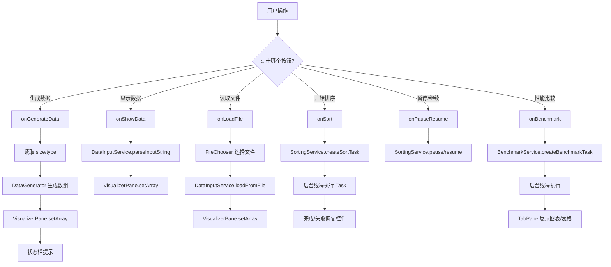

---

#### ③ 动画排序服务（SortingService）：回调驱动 + 暂停/继续

功能：创建排序任务，在后台线程执行 `Sorter.sort`，并通过 `SortStepListener` 把步骤映射为 UI 更新；同时实现“暂停/继续”。

关键设计点：

- 排序在线程中执行（Task 的 `call()`）
- UI 更新通过 `Platform.runLater` 切回 JavaFX UI 线程
- 每个事件回调后调用 `sleep()` 控制速度
- 暂停通过 `paused` + `pauseLock.wait/notifyAll` 实现

图3：SortingService 内部监听器处理流程图

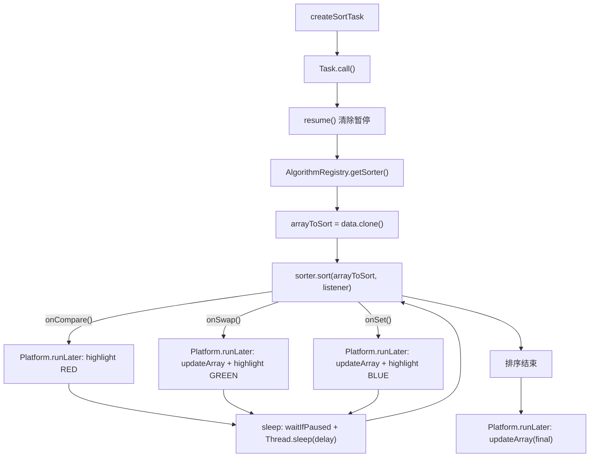

图4：暂停/继续同步流程图

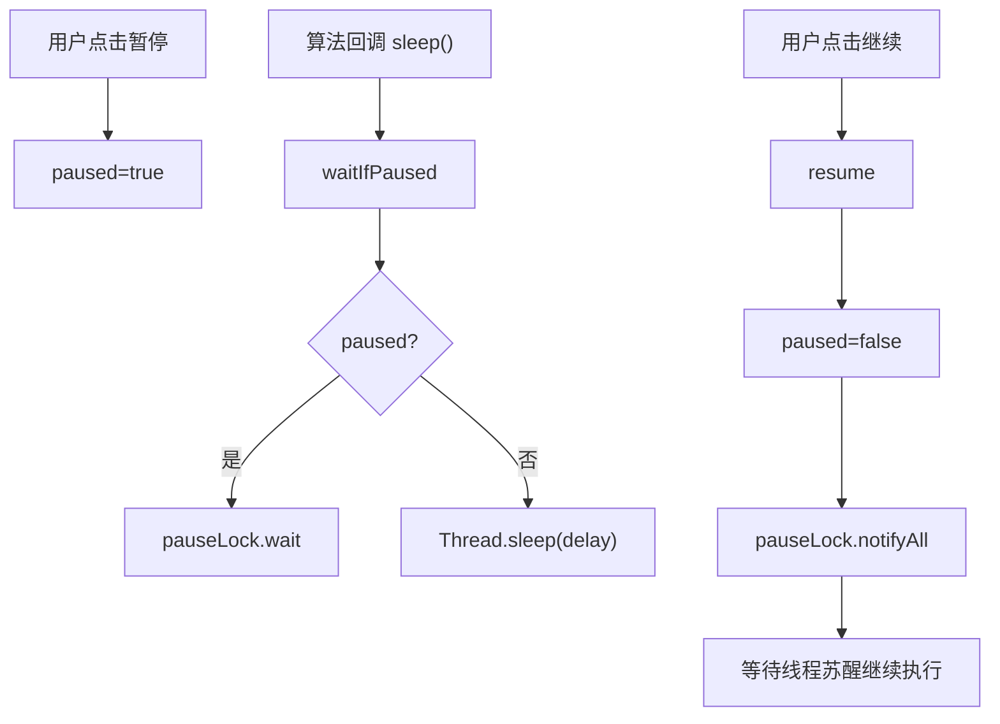

---

#### ④ 数据输入服务（DataInputService）：字符串解析与文件读取

功能：支持自定义输入与文件读取，两者最终都转为 `int[]`。

解析规则（与代码一致）：

- 将换行 `\n/\r` 归一化为空格
- 使用正则分隔符 `[ ,;\t]+` 拆分 token
- 逐个 `Integer.parseInt`
- 输入为空/解析不到整数/包含非整数 token 则抛 `IllegalArgumentException`

图5：parseInputString 流程图

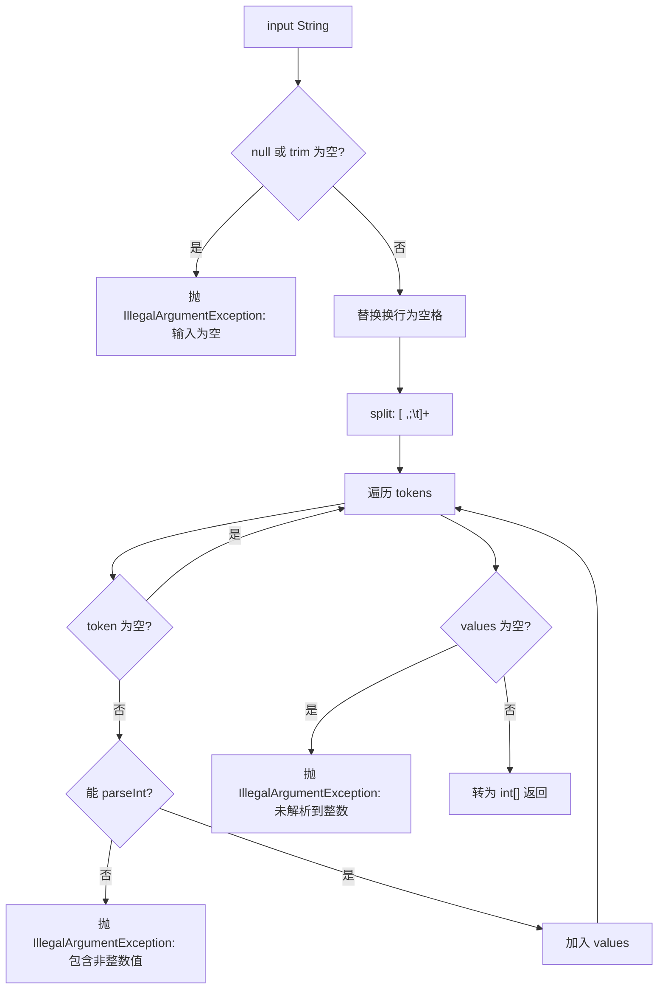

图6：loadFromFile 流程图

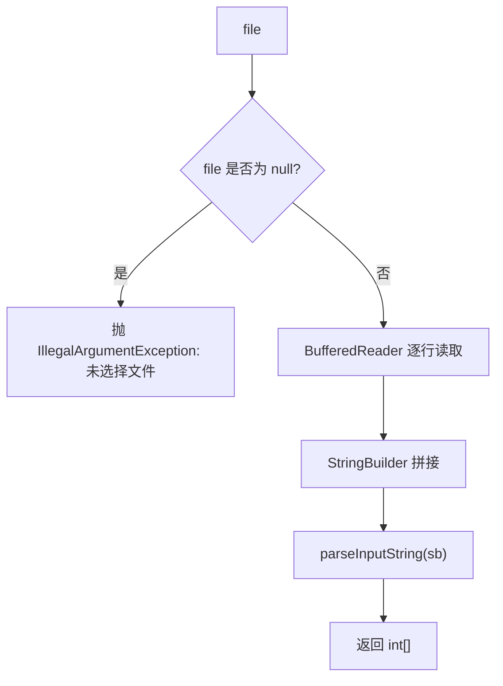

---

#### ⑤ 性能比较服务（BenchmarkService）：耗时与内存估算

功能：在不启用动画回调（listener = null）的情况下运行多个算法，对同一份数据进行测试并生成 `PerformanceMetrics` 列表。

关键点（与代码一致）：

- `baseArray = generateData(size, dataType)`
- 对每个算法：`arrayCopy = baseArray.clone()`
- `System.gc()` 后 `Thread.sleep(100)` 尝试降低测量波动
- `startMem/endMem = totalMemory - freeMemory`，`memoryUsed = max(0, endMem - startMem)`
- `timeElapsed = endTime - startTime`（纳秒）

图7：BenchmarkService 流程图

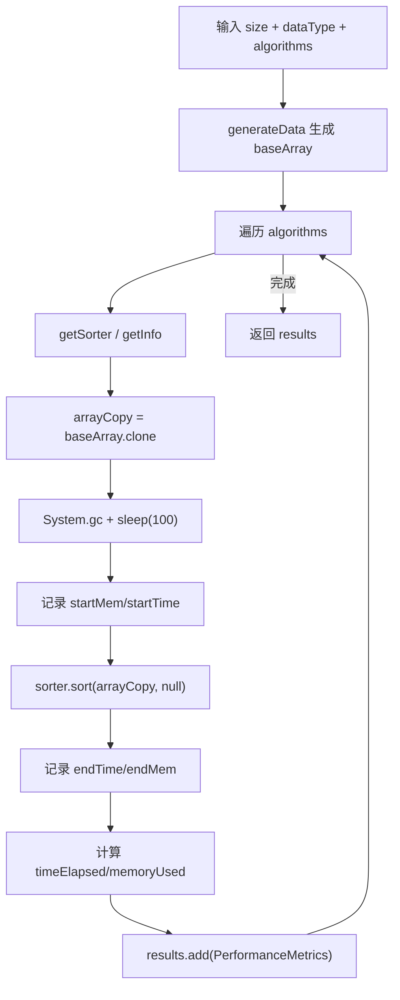

补充说明（与 UI 一致性）：界面下拉选项为“逆序数据”，性能模块也支持该字符串（并兼容历史拼写“递序数据”）。

---

#### ⑥ 算法注册表（AlgorithmRegistry）：算法与元数据统一管理

功能：集中注册并管理全部排序算法实例（`Sorter`）以及它们的元数据（`AlgorithmInfo`），供 UI 下拉框、排序服务与性能测试模块统一使用。

实现要点（与代码一致）：

- 采用 `LinkedHashMap`：保证算法名称列表的迭代顺序稳定（展示顺序固定）。
- 使用静态代码块一次性注册全部算法，注册方法 `register(Sorter sorter, AlgorithmInfo info)` 将 `info.name()` 作为 key。
- 对外提供：`getSorter(name)`、`getInfo(name)`、`getAllAlgorithmNames()`、`getAllSorters()`。

图8：AlgorithmRegistry 注册与查询流程图

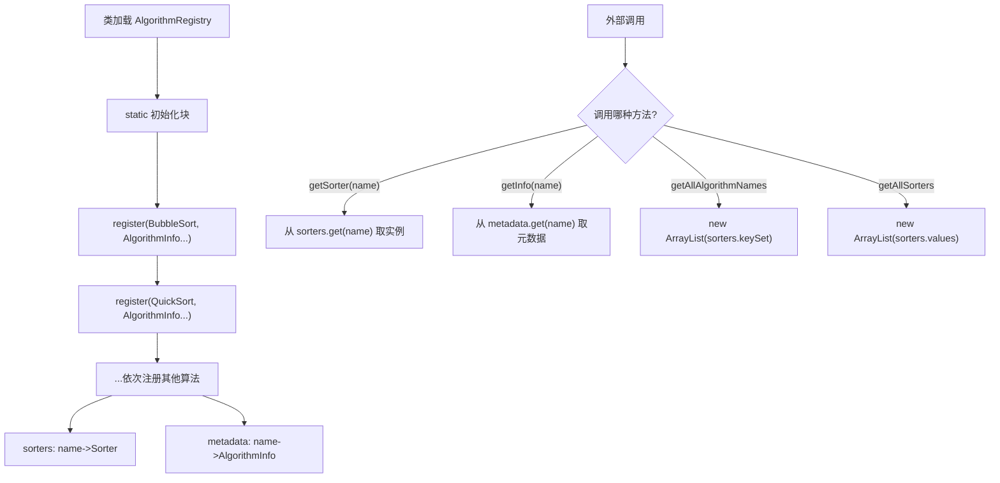

---

#### ⑦ 数据生成器（DataGenerator）：实验数据构造策略

功能：提供多种数据生成策略，用于“动画演示数据”和“性能比较基准数据”。

实现要点（与代码一致）：

- `generateLinearShuffledData(size)`：生成 `1..size` 后做 Fisher-Yates 洗牌（每个高度唯一，适合可视化）。
- `generateSortedData(size)`：生成递增序列 `1..size`。
- `generateReversedData(size)`：生成递减序列 `size..1`。
- `generateNearlySortedData(size)`：先生成有序 `1..size`，再随机交换约 `10%` 次制造少量乱序。
- `generateRandomData(size, maxValue)`：生成 `1..maxValue` 的随机数（值域可重复）。

图9：DataGenerator 典型生成策略流程图

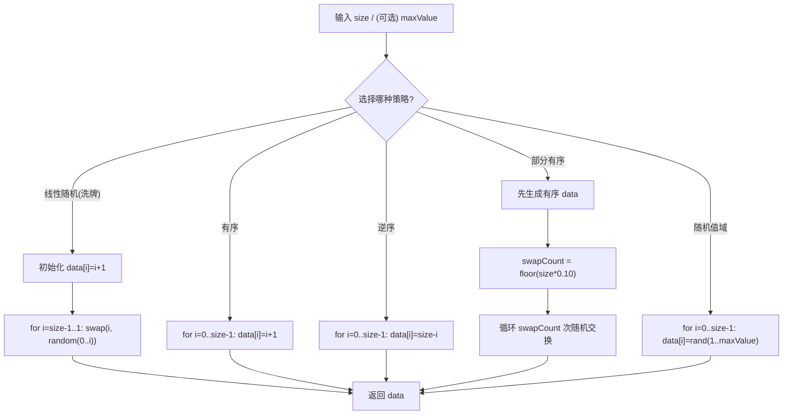

---

#### ⑧ 可视化面板（VisualizerPane）：柱状图绘制与高亮

功能：把数组绘制为柱状图，并在比较/交换/写回时进行颜色高亮。

绘制要点：

- `setArray/updateArray` 均进行数组 clone，避免外部引用改变
- 计算 `maxVal` 用于归一化：`unitPx = innerHeight / maxVal`
- 每个柱的高度：`barHeight = v * unitPx`，当 `v>0 且 barHeight<1` 时最少显示 1px
- 当 `showLabels==true 且 barWidth>=16` 时绘制文本标签

图10：VisualizerPane.draw 流程图

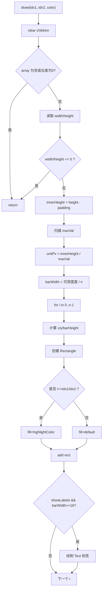

---

#### ⑨ 算法层：核心排序算法“关键步骤与回调点”设计

本系统中不同排序算法的“动画表达方式”不完全相同：交换型算法以 `onSwap` 为核心，覆盖写回型算法以 `onSet` 为核心。下面以项目中实现的核心算法为例说明。

##### a）快速排序（QuickSort）

实现方式：递归 + Lomuto 分区。

- 每次比较 `array[j]` 与 pivot（`array[high]`）触发 `onCompare(j, high)`
- 发生交换触发 `onSwap(i, j)`；分区结束触发 `onSwap(i+1, high)`

图11：QuickSort.partition 流程图

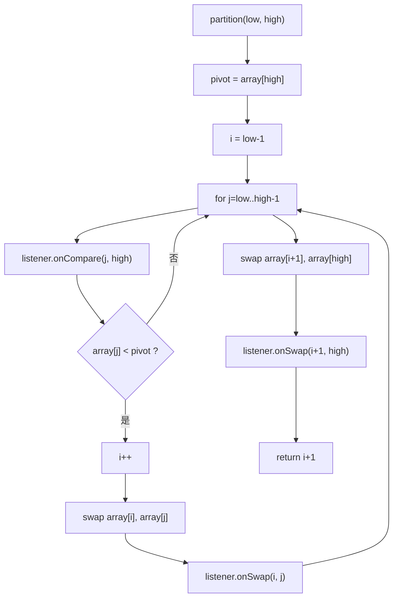

##### b）归并排序（MergeSort）

实现方式：递归二分 + 合并。

- 合并阶段以覆盖写回为主：每次写回触发 `onSet(k, value)`
- 比较阶段触发 `onCompare(l+i, m+1+j)`（用于近似高亮）

图12：MergeSort.merge 合并流程图

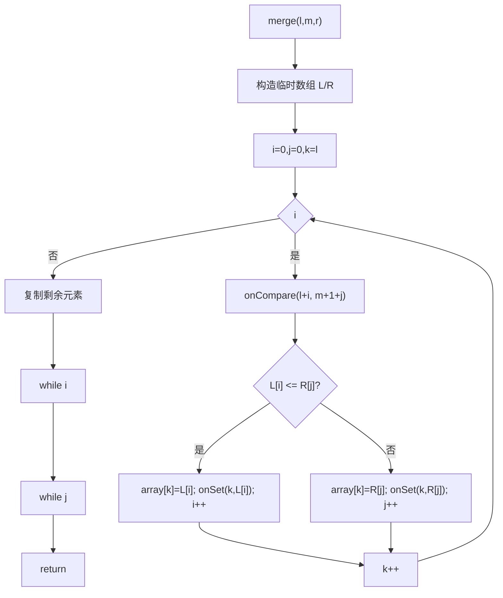

##### c）堆排序（HeapSort）

实现方式：先建堆，再逐步把堆顶交换到末尾，并对剩余区间 heapify。

- heapify 中比较左右孩子与 largest 触发 `onCompare(child, largest)`
- 发生交换触发 `onSwap(i, largest)`

图13：HeapSort.heapify 流程图

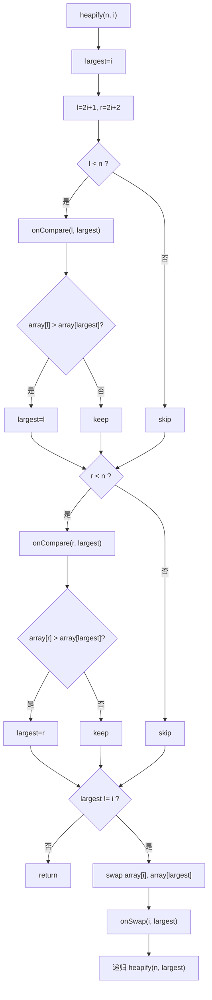

##### d）桶排序（BucketSort）

实现方式：扫描 max/min → 分桶 → 桶内插入排序 → 合并写回。

- 扫描 max/min 时：用 `onCompare(i,0)` 提供视觉反馈
- 分配到桶时：用 `onCompare(i,i)` 提供步骤反馈
- 合并写回主数组时：对每个写回触发 `onSet(index,val)`
- 桶内排序使用自写插入排序（满足“不能用内置排序”要求），比较触发 `onCompare(baseIndex+j, baseIndex+j+1)`（用于近似高亮）

图14：BucketSort 总流程图

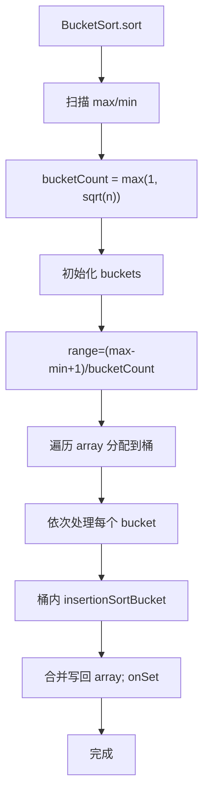

##### e）计数排序（CountingSort）

实现方式：扫描 max/min → 统计频率 count → 前缀和 → 输出数组 output → 覆盖写回。

- 统计频率阶段用 `onCompare(i,i)` 做视觉反馈
- 覆盖写回阶段用 `onSet(i, value)` 驱动动画

图15：CountingSort 流程图

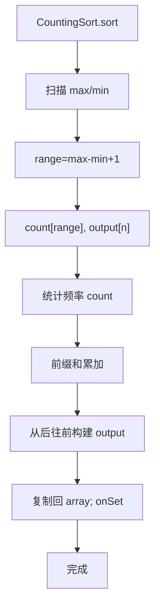

##### f）基数排序（RadixSort，LSD）

实现方式：按位（exp=1,10,100...）重复执行“计数排序”。

- 每轮统计时用 `onCompare(i,i)` 反馈
- 每轮写回数组时用 `onSet(i, value)` 驱动动画

图16：RadixSort 流程图

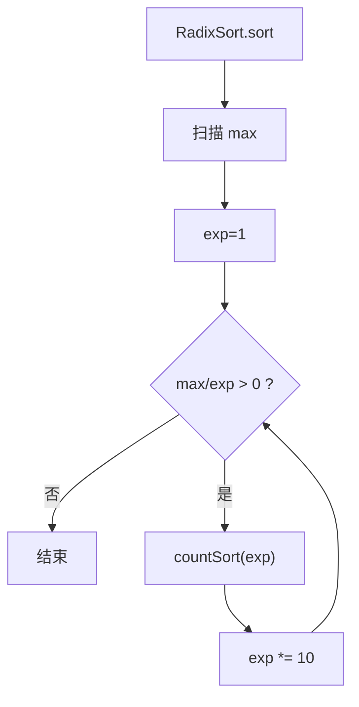

---

## 5、编码与调试分析（扩充版）

### (1) 编码实现要点（结合本项目）

1）UI 与耗时操作解耦

本项目将排序执行放在后台线程（JavaFX `Task`）中，避免 UI 卡死；所有 UI 更新通过 `Platform.runLater` 回到 JavaFX UI 线程完成。此设计保证了动画速度调节、暂停/继续按钮在排序运行时仍可响应。

2）三类事件统一表达算法步骤

为了同时支持“交换型”（快排/堆/冒泡/选择）与“覆盖写回型”（归并/计数/基数/桶/插入部分步骤）算法，本项目提供 `onCompare/onSwap/onSet` 三类事件：

- 交换型主要靠 `onSwap`
- 写回型主要靠 `onSet`
- `onCompare` 用于强调比较关系并提升可理解性

3）暂停/继续实现方式

排序过程的暂停不是中断线程，而是让每一步回调后的 `sleep()` 进入 `pauseLock.wait()`；继续时 `notifyAll()` 唤醒。这样可以做到“步骤级暂停”，不会破坏算法内部状态。

4）性能比较不启用回调

性能比较采用 `sorter.sort(arrayCopy, null)`，避免动画回调和 `Thread.sleep(delay)` 引入额外开销，尽量测量算法真实耗时。

---

### (2) 编码与调试过程中常见问题及解决办法（允许适当扩充）

下面的“问题”包含两类：A）本项目结构下真实可能发生的错误；B）课程设计中常见且与本项目强相关的错误（用于丰富报告内容）。每个问题都给出定位思路与解决方法。

【问题一】排序时界面卡死 / 按钮无响应

现象：点击“开始排序”后界面冻结，窗口无响应。

常见原因：

- 在 UI 线程直接执行排序或 `Thread.sleep()`

解决办法（本项目的做法）：

- 使用 `SortingService.createSortTask` 在后台线程运行排序。
- 在回调中使用 `Platform.runLater` 更新界面。

【问题二】动画高亮错位、闪烁或出现异常颜色

现象：高亮位置与实际比较/交换不一致；或高亮频繁闪烁导致看不清。

常见原因：

- 算法回调传入的索引与 UI 当前数组版本不同步；
- 非交换型算法（归并/计数/基数）只触发 compare，没有 set 导致 UI 不更新；
- delay 过小（速度太快）导致看起来“闪”。

解决办法：

- 交换型算法在交换后触发 `onSwap`；写回型算法在每次写回触发 `onSet`，并在回调里调用 `visualizerPane.updateArray(arrayToSort)`。
- 速度调节把 delay 拉大，或减少 compare 回调次数（如只在关键比较触发）。

【问题三】暂停后无法继续 / 一直处于暂停状态

现象：点击“暂停”后再点“继续”没有反应。

常见原因：

- wait/notify 使用不当；
- 没有在开始排序时清除 paused 标志。

解决办法（本项目的做法）：

- 每次 `createSortTask` 开始时调用 `resume()` 确保 `paused=false`。
- `resume()` 中 `notifyAll()` 唤醒所有等待线程。

【问题四】读取文件或自定义输入报错（IllegalArgumentException / NumberFormatException）

现象：弹出“解析失败/读取失败”。

常见原因：

- 输入为空；
- 含非整数 token（例如 `1,2,a,3`）；
- 文件中含中文逗号、特殊分隔符未被正则覆盖。

解决办法：

- 按报错提示定位具体 token；
- 建议使用英文分隔符或先在输入框中验证；
- 若需要增强，可扩展分隔符正则（属于提高要求）。

【问题五】自定义输入包含负数时柱状图显示异常

现象：出现负高度、柱子反向或不可见。

原因：

- `VisualizerPane` 的高度归一化基于 maxVal，并假设数值为正；负值会导致 barHeight 负数。

解决办法：

- 课程设计中可规定输入数据为非负整数；
- 或在绘制前对数据做平移（minVal < 0 时整体加偏移量）。

【问题六】性能比较结果波动大、不同次运行差距明显

现象：同一算法多次跑出来耗时差异较大。

常见原因：

- JVM JIT 编译、GC、系统后台进程影响；
- 内存“估算”方法本身误差较大。

解决办法：

- 采用多次运行取平均值或中位数（可作为进一步改进点）；
- 说明内存为估算值；
- 使用更专业基准框架（如 JMH）作为扩展方向。

【问题七】快速排序极端数据下递归过深导致栈溢出（常见扩充项）

现象：在某些极端输入（例如已排序且 pivot 选择不佳）下，递归深度接近 n，可能导致 `StackOverflowError`。

解决办法（常见思路）：

- 选择更稳健的 pivot（随机 pivot、三数取中）；
- 改写为非递归版本；
- 或在课程报告中说明“最坏复杂度 O(n^2)”与递归深度风险。

【问题八】桶排序分桶边界处理不当导致越界（与本项目实现相关）

现象：最大值分到 `bucketCount` 导致 `IndexOutOfBoundsException`。

解决办法（本项目的做法）：

- 计算 bucketIndex 后做防守：若 `bucketIndex >= bucketCount` 则强制设为 `bucketCount - 1`。

【问题九】性能比较的“逆序数据”类型不生效（与本项目实现相关）

现象：界面选择“逆序数据”，但 benchmark 生成的数据仍像随机数据。

原因：

- 数据类型字符串不一致会导致 switch 走 default。

解决办法：

- 统一字符串为“逆序数据”，并保留历史拼写兼容分支。

---

### (3) 待解决问题（可写“无”或写改进方向）

① 内存占用目前为粗略估算，可考虑改为多次测量取平均值；
② 对负数输入的可视化支持可进一步完善（平移/归一化）；
③ 性能比较可增加“多次运行取平均/中位数”的选项（提高要求）。
