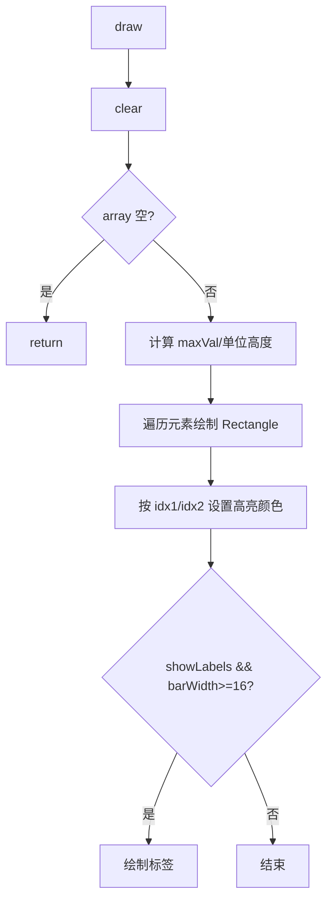

# 《数据结构与算法课程设计》

## 补充文档：第4章详细设计 + 第5章编码与调试分析（示例格式版）

说明：本文件是在 [详细设计与编码调试分析_中文版.md](详细设计与编码调试分析_中文版.md) 的内容基础上，按你提供的示例“段落组织与标题格式”重新排版生成；功能描述、流程图与代码片段均以本项目源码（Java 17 + JavaFX + Maven）为准，未引入与项目不符的内容。

---

## 4．详细设计

（1）实现概要设计的数据类型：

说明：你这里希望用“第一层”的含义，即 Java 语言层面的数据类型（基本类型、数组、标准库集合、以及项目中自定义的引用类型）。本系统的核心数据类型如下。

1）基本类型（primitive）

- `int`：数组元素值、索引、数据规模等。
  - 例：排序方法的核心数据是 `int[]`，索引与元素均为 `int`。
- `long`：动画延迟（毫秒）、性能计时（纳秒）、内存估算（字节）。
- `boolean`：暂停状态、是否显示标签、算法稳定性标记等。
- `double`：部分算法计算中间量（例如桶排序的 `range`），以及结果展示中的单位换算。

代码示例（来自 Controller/Service 的字段类型）：

```java
private int[] currentArray;
private long delay = 50;
private volatile boolean paused;
```

2）字符串类型（String）

`String` 用于表示：算法名称、数据类型（随机/有序/逆序/部分有序）、提示文本等。

```java
String algorithmName = algorithmComboBox.getValue();
String type = dataTypeComboBox.getValue();
```

3）数组类型（int[]）

系统的“被排序数据”统一用 `int[]` 表示；为了避免 UI 源数组被直接修改，服务层会对数组做 `clone()`。

```java
int[] arrayToSort = data.clone();
```

4）集合类型（List/Map 等）

- `List<String>`：算法名称列表（用于下拉框）。
- `List<PerformanceMetrics>`：性能测试输出结果集合。
- `Map<String, Sorter>`、`Map<String, AlgorithmInfo>`：算法注册表中“名称→实例/元数据”的映射。
- `List<List<Integer>>`：桶排序分桶结构（每个桶是一个 `List<Integer>`）。

典型声明（来自注册表/桶排序/基准测试）：

```java
private static final Map<String, Sorter> sorters = new LinkedHashMap<>();
private static final Map<String, AlgorithmInfo> metadata = new LinkedHashMap<>();

List<List<Integer>> buckets = new ArrayList<>(bucketCount);

Task<List<PerformanceMetrics>> task;
```

5）并发与 JavaFX 相关类型（Task/LongSupplier/Color 等）

- `Task<Void>`：排序动画任务（后台线程执行，UI 线程更新）。
- `Task<List<PerformanceMetrics>>`：基准测试任务（返回结果列表）。
- `LongSupplier`：为排序服务提供“当前速度对应的延迟值”。
- `Color`：高亮颜色（比较红/交换绿/写回蓝）。

6）项目自定义引用类型（class/interface/record）

这些是“引用类型（Reference Type）”，属于 Java 的数据类型体系的一部分：

- `Sorter`、`SortStepListener`：算法层与动画回调接口；
- `AlgorithmInfo`、`PerformanceMetrics`：record 类型，承载元数据/测试结果；
- `SortingService`、`BenchmarkService`、`DataInputService`：服务层类型；
- `MainController`、`VisualizerPane`：控制器与视图类型。

（说明：这一小条只是在“类型分类”上说明它们是引用类型；具体算法流程在（2）（3）里展开。）

（2）主程序以及主要模块的算法描述：（列出核心模块算法即可，建议不超过3个核心模块）

本节选择 3 个核心模块进行“主流程 + 核心算法/逻辑步骤”描述：
1）主程序入口（启动并加载界面）；2）排序动画服务（回调驱动可视化 + 暂停/继续）；3）性能比较服务（批量测试并输出指标）。

① 主程序入口（SortingVisualizerApp）

主函数具体代码：

```java
@Override
public void start(Stage stage) throws IOException {
    FXMLLoader fxmlLoader = new FXMLLoader(
        SortingVisualizerApp.class.getResource("/org/example/sortingvisualizer/view/MainLayout.fxml")
    );
    Scene scene = new Scene(fxmlLoader.load(), 1200, 800);
    stage.setTitle("排序算法性能比较与动画演示系统");
    stage.setScene(scene);
    stage.show();
}

public static void main(String[] args) {
    launch();
}
```

这个模块主要完成 UI 启动与 FXML 加载。其步骤为：启动 JavaFX → 加载 `MainLayout.fxml` → 创建场景 → 设置舞台标题与场景 → 显示窗口。界面按钮事件随后由 `MainController` 接管。

图1：主程序启动流程图

```mermaid
flowchart TD
    A["main: launch()"] --> B[start(Stage)]
    B --> C[FXMLLoader.load(MainLayout.fxml)]
    C --> D[创建 Scene(1200x800)]
    D --> E[stage.setTitle]
    E --> F[stage.setScene]
    F --> G[stage.show]
```

---

② 排序动画服务（SortingService）：回调驱动 + 暂停/继续

功能：在后台线程执行 `Sorter.sort`，并将算法关键步骤映射为 UI 动画更新。该模块的核心是“回调监听器 + 速度控制 + 暂停协议”。

其算法/逻辑步骤为：
1）创建 `Task`，开始执行时先 `resume()`，避免继承上一次暂停状态；
2）通过 `AlgorithmRegistry.getSorter(algorithmName)` 取得算法实例；
3）对原始数组做 `clone()` 得到 `arrayToSort`，避免破坏 UI 的源数组引用；
4）调用 `sorter.sort(arrayToSort, listener)`，在 listener 的 `onCompare/onSwap/onSet` 中使用 `Platform.runLater(...)` 更新 `VisualizerPane`；
5）每次回调后执行 `sleep()`：先 `waitIfPaused()`，再按滑块提供的 delay 休眠；
6）排序结束后再一次 `updateArray(arrayToSort)` 展示最终结果。

图2：SortingService 内部监听器处理流程图

```mermaid
flowchart TD
    A[createSortTask] --> B[Task.call]
    B --> C[resume 清除暂停]
    C --> D[AlgorithmRegistry.getSorter]
    D --> E[arrayToSort = data.clone]
    E --> F[sorter.sort(arrayToSort, listener)]

    F -->|onCompare| G[Platform.runLater: highlight RED]
    F -->|onSwap| H[Platform.runLater: updateArray + highlight GREEN]
    F -->|onSet| I[Platform.runLater: updateArray + highlight BLUE]

    G --> J[sleep: waitIfPaused + Thread.sleep(delay)]
    H --> J
    I --> J

    F --> K[排序结束]
    K --> L[Platform.runLater: updateArray(final)]
```

图3：暂停/继续同步流程图

```mermaid
flowchart TD
  A[用户点击暂停] --> B[paused=true]
  C[算法回调 sleep()] --> D[waitIfPaused]
  D --> E{paused?}
  E -->|是| F[pauseLock.wait]
  E -->|否| G[Thread.sleep(delay)]

  H[用户点击继续] --> I[resume]
  I --> J[paused=false]
  J --> K[pauseLock.notifyAll]
  K --> L[等待线程苏醒继续执行]
```

---

③ 性能比较服务（BenchmarkService）：耗时与内存估算

功能：对多个算法进行基准测试，得到耗时与内存估算，并输出为 `List<PerformanceMetrics>`，供 UI 绘制柱状图与表格。

其算法/逻辑步骤为：
1）先按数据类型生成 `baseArray`（随机/有序/逆序/部分有序）；
2）对每个算法：取 `Sorter` 与 `AlgorithmInfo`，并克隆一份 `arrayCopy`；
3）执行 `System.gc()` 并短暂 `sleep(100)`，尽量降低测量波动；
4）记录 `startMem` 与 `startTime`；
5）调用 `sorter.sort(arrayCopy, null)`（不传监听器、不做动画）；
6）记录 `endTime/endMem`，计算 `timeElapsed/memoryUsed` 并写入 `PerformanceMetrics`。

图4：BenchmarkService 流程图

```mermaid
flowchart TD
  A[输入 size + dataType + algorithms] --> B[generateData 生成 baseArray]
  B --> C[遍历 algorithms]
  C --> D[getSorter / getInfo]
  D --> E[arrayCopy = baseArray.clone]
  E --> F[System.gc + sleep(100)]
  F --> G[记录 startMem/startTime]
  G --> H[sorter.sort(arrayCopy, null)]
  H --> I[记录 endTime/endMem]
  I --> J[计算 timeElapsed/memoryUsed]
  J --> K[results.add(PerformanceMetrics)]
  K --> C
  C -->|完成| L[返回 results]
```

（3）其它模块的算法描述

本节不再逐一列出全部代码，只对其它模块的“核心算法思想/步骤”进行说明，并补充其效率特点与适用范围。

1）主界面控制器（MainController）

功能：负责 UI 交互与任务编排（生成数据、开始排序、暂停/继续、性能比较、显示自定义数据、读取文件）。

核心步骤概述：

- 生成数据：从输入框读取规模与类型 → 调用 `DataGenerator` → `VisualizerPane.setArray` 重绘；
- 排序动画：读取算法名 → 调用 `SortingService.createSortTask` → 启动后台线程；
- 性能比较：准备算法列表 → 调用 `BenchmarkService.createBenchmarkTask` → 展示结果图表/表格。

效率与特点：控制器本身不做算法计算，主要成本来自任务创建与 UI 更新，复杂度与数据规模关系不大。

2）数据输入服务（DataInputService）

功能：将用户输入字符串或文件内容解析为 `int[]`。

核心步骤概述：

- 归一化换行为空格；
- 按分隔符正则 `[ ,;\t]+` 切分 token；
- 逐个 `Integer.parseInt`；
- 异常/空输入则抛 `IllegalArgumentException`。

效率与特点：线性扫描，时间复杂度 $O(n)$，其中 $n$ 为 token 数；健壮性主要靠输入校验与异常提示。

图5：parseInputString 流程图

```mermaid
flowchart TD
  A[输入字符串] --> B{输入为空或仅空格?}
  B -->|是| C[抛 IllegalArgumentException]
  B -->|否| D[替换换行符为空格]
  D --> E[split: [ ,;\t]+]
  E --> F[遍历 tokens 并 parseInt]
  F --> G{是否存在非整数?}
  G -->|是| H[抛 IllegalArgumentException]
  G -->|否| I[转为 int[] 返回]
```

3）可视化绘制（VisualizerPane）

功能：将数组绘制为柱状图，并在 `onCompare/onSwap/onSet` 时高亮对应柱子。

核心步骤概述：

- 计算 `maxVal` 并按画布高度归一化；
- 逐个元素绘制矩形柱；
- 若为高亮索引则设置高亮颜色；
- 可选绘制数值标签。

效率与特点：绘制成本与数组长度线性相关，单次重绘时间复杂度约为 $O(n)$；动画效果的流畅性与 delay、柱子数量、机器性能有关。

图6：VisualizerPane.draw 流程图



4）算法层（部分算法特征补充）

- 快速排序（QuickSort）：平均 $O(n\log n)$，最坏 $O(n^2)$，不稳定；本项目通过 `onCompare(j, high)` 与 `onSwap` 驱动动画；
- 归并排序（MergeSort）：稳定，时间 $O(n\log n)$，空间 $O(n)$；动画主要以 `onSet(k,value)` 表达“覆盖写回”；
- 堆排序（HeapSort）：时间 $O(n\log n)$，空间 $O(1)$，不稳定；动画以 `heapify` 的 `onCompare/onSwap` 为主；
- 桶排序（BucketSort）：本项目按 `sqrt(n)` 取桶数并做边界防守；桶内使用自写插入排序（不依赖内置排序）。

图7：BucketSort 总流程图

```mermaid
flowchart TD
  A[BucketSort.sort] --> B[扫描 max/min]
  B --> C[bucketCount=max(1,sqrt(n))]
  C --> D[range=(max-min+1)/bucketCount]
  D --> E[分配元素到桶]
  E --> F[桶内插入排序]
  F --> G[合并写回; onSet]
  G --> H[完成]
```

---

## 5、编码与调试分析

1．编码与调试过程中遇到的问题及解决办法：

【问题一】排序动画时界面卡死 / 无法响应按钮

解决办法：将排序放入 JavaFX `Task` 在后台线程运行，并把所有 UI 更新放入 `Platform.runLater(...)`，避免在 UI 线程中执行耗时排序或 `Thread.sleep()`。

解决此问题的核心代码：

```java
// SortingService: 在回调中切回 UI 线程更新
@Override
public void onCompare(int index1, int index2) {
    Platform.runLater(() -> visualizerPane.highlight(index1, index2, Color.RED));
    sleep();
}
```

【问题二】暂停后无法继续（线程一直卡住）

解决办法：暂停不直接中断线程，而是在每一步 sleep 前检查 `paused`，若为 true 则在 `pauseLock` 上等待；继续时将 `paused=false` 并 `notifyAll()` 唤醒等待线程。

解决此问题的核心代码：

```java
// SortingService: wait/notify 实现“步骤级暂停”
private void waitIfPaused() throws InterruptedException {
    synchronized (pauseLock) {
        while (paused) {
            pauseLock.wait();
        }
    }
}

public void resume() {
    synchronized (pauseLock) {
        paused = false;
        pauseLock.notifyAll();
    }
}
```

【问题三】性能比较结果不可信（把动画延迟/回调开销也算进去了）

解决办法：性能比较时不传监听器（`listener = null`），只执行纯排序逻辑，避免 UI 回调与动画延迟影响测量。

解决此问题的核心代码：

```java
// BenchmarkService: 只测算法，不启用可视化监听器
sorter.sort(arrayCopy, null);
```

【问题四】桶排序分桶时最大值越界（常见：IndexOutOfBoundsException）

解决办法：由于浮点 range 与整除会导致最大值恰好落在 bucketCount 上，本项目在计算 bucketIndex 后进行了边界防守，保证最大值进入最后一个桶。

解决此问题的核心代码：

```java
int bucketIndex = (int) ((array[i] - minVal) / range);
if (bucketIndex >= bucketCount) bucketIndex = bucketCount - 1;
```

【问题五】输入解析失败（自定义数据/文件数据包含非法字符）

解决办法：解析时统一做 token 切分与 `parseInt` 校验，遇到空输入、无法解析的 token、解析结果为空等情况直接抛 `IllegalArgumentException`，由控制器捕获后弹框提示；避免异常直接打断 UI。

（说明：此处错误提示由 `MainController` 捕获并通过 `Alert` 展示，保证程序不会崩溃。）

2．待解决问题：

① 性能比较目前为单次测量，受 JIT/GC/系统负载影响会有波动；可进一步改为“多次运行取平均/中位数”。

② 内存占用为粗略估算（`totalMemory-freeMemory` 差值），仅用于横向对比；如需更严谨可采用专业基准方案（例如 JMH，作为扩展方向）。

③ 当数据规模较大且速度较快时，频繁 `runLater` 可能导致 UI 更新队列堆积；可进一步通过降低回调频率或合并绘制来优化（提高要求）。

---

## 6、使用说明

1．运行环境与启动方式

（1）运行环境

本程序基于 Java 17 与 JavaFX 17，使用 Maven 构建运行。运行前需确保：

① 已安装 JDK 17（或更高但兼容的版本），并正确配置 `JAVA_HOME`；
② 已安装 Maven（能在命令行执行 `mvn -v`）。

（2）启动方式

在项目根目录（包含 `pom.xml` 的目录）打开终端，执行：

```bash
mvn clean javafx:run
```

启动后会打开主窗口，标题为“排序算法性能比较与动画演示系统”。

2．界面操作步骤（从“生成数据”到“排序/比较”）

（1）生成数据并显示

① 在“数据规模”输入框填写数据数量（程序会限制范围，过大将被截断，上限为 500，下限为 5）；
② 在“数据类型”下拉框选择：随机数据 / 有序数据 / 逆序数据 / 部分有序；
③ 点击“生成数据”，系统会生成 `int[]` 并在柱状图区域显示。

（2）开始排序动画

① 在“算法”下拉框选择需要演示的排序算法（名称来自算法注册表）；
② 点击“开始排序”；
③ 排序过程中，比较/交换/写回会以不同颜色高亮显示；
④ 可通过“速度滑块”调整动画速度（滑块越大，延迟越小，动画越快）。

（3）暂停与继续

排序开始后，“暂停/继续”按钮可用。

① 点击“暂停”后，排序会在下一步进入等待状态；
② 再次点击可“继续”，排序从暂停点恢复。

（4）性能比较

① 设定数据规模与数据类型；
② 点击“性能比较”，系统会对一组算法进行基准测试（不启用动画回调）；
③ 测试完成后在界面中展示耗时、内存估算及详细数据表。

说明：为避免个别演示型算法耗时过长，性能比较通常会排除极端低效或特殊演示算法（如猴子排序/睡眠排序/珠排序）。

3．自定义数据与文件输入

（1）自定义输入

在自定义数据输入框中输入整数序列，支持分隔符：空格、英文逗号、分号、Tab、换行等（例如 `1,2,3` 或 `1 2 3`）。点击“显示数据”后即可在柱状图中显示。

若输入为空、包含非整数内容或无法解析，会弹出错误提示框。

（2）从文件读取

点击“读取文件”选择 `*.txt` 或 `*.csv` 文件，文件内容按与自定义输入相同的规则解析为整数序列，并显示到柱状图。

4．显示设置与注意事项

（1）“显示数值”勾选框用于控制柱子上是否显示数值标签；仅影响绘制，不影响排序。

（2）建议使用非负整数数据进行演示与测试；若输入包含负数，柱状图高度归一化可能出现显示不直观（可作为后续扩展优化点）。

（3）当数据规模较大且速度较快时，动画可能因 UI 刷新频繁而出现卡顿，可适当降低速度或减少数据规模。
