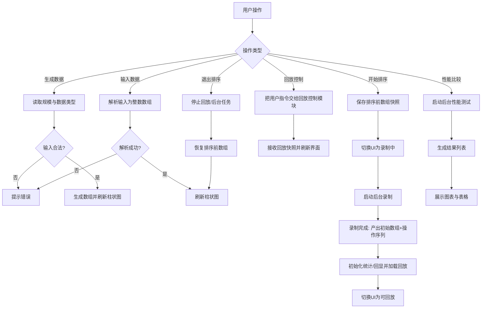
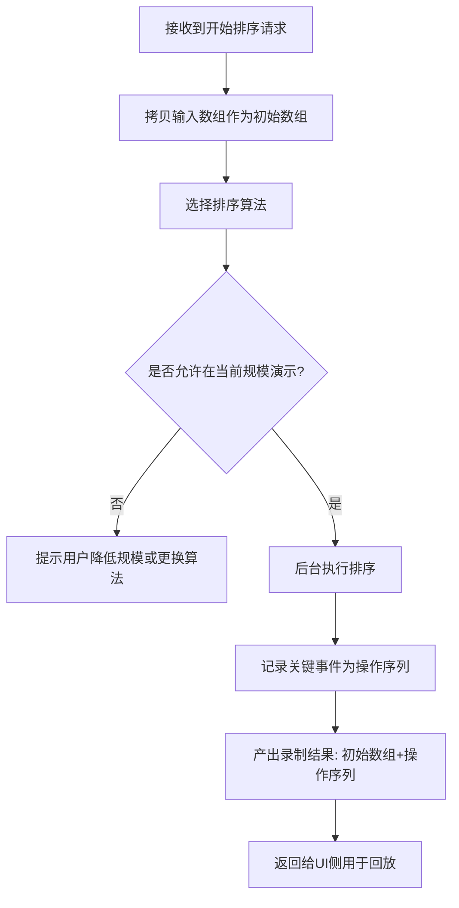
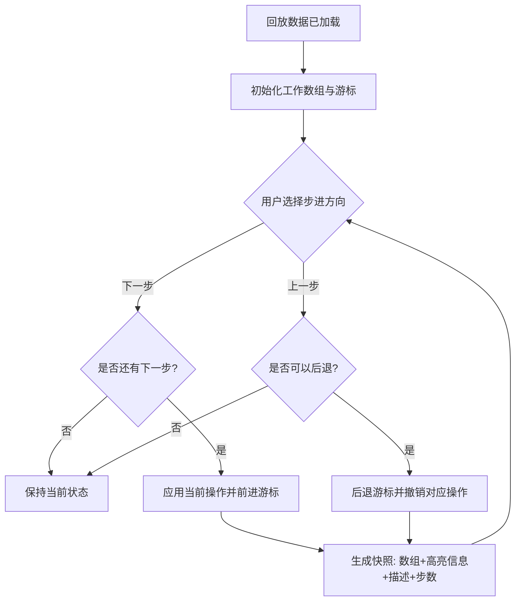
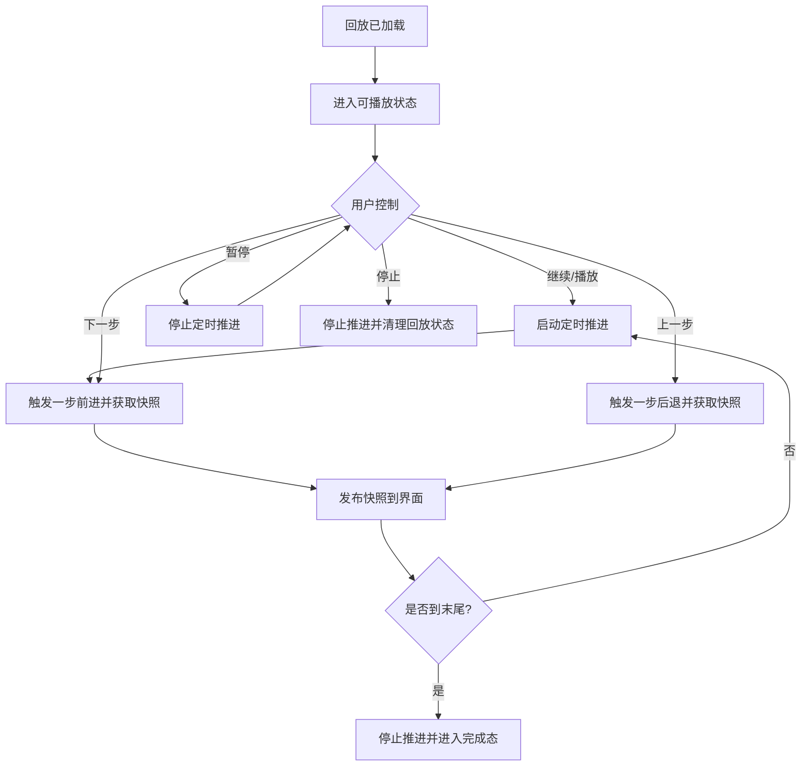
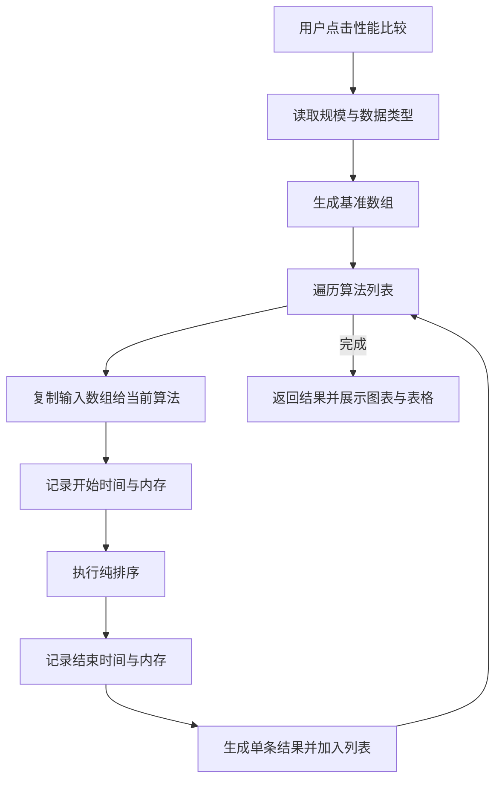
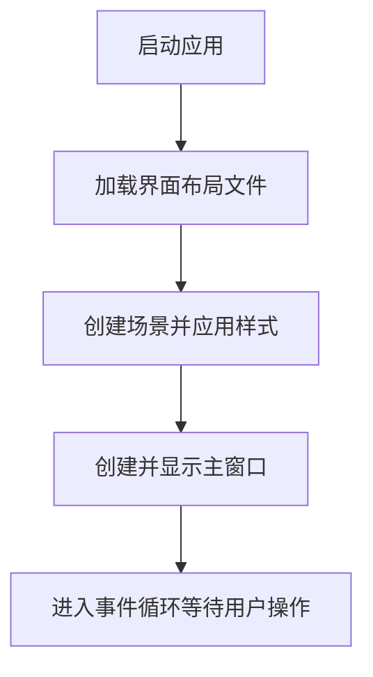
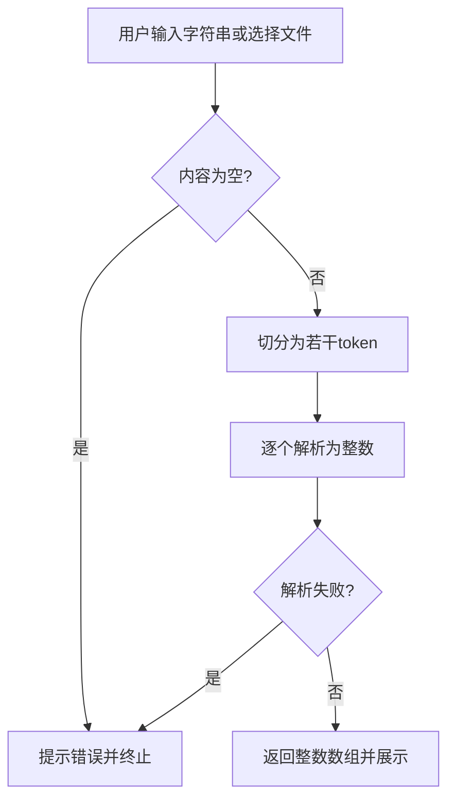
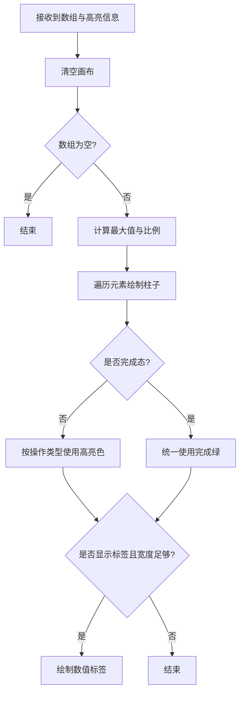

# 《数据结构与算法课程设计》

## 补充文档：第4章详细设计 + 第5章编码与调试分析（示例格式版｜对齐现状重写）

说明：本文件为“完整重写版”，用于对齐当前项目的实际实现（Java 17 + JavaFX + Maven）。

核心变化（相对旧版示例文档）：本系统的排序演示从“实时回调动画”升级为“先录制步骤，再回放/撤销”。因此支持：上一步/下一步、操作回显、步骤统计、排序完成态统一绿色等。

约束：文中的流程图只描述流程与模块边界，不出现任何函数名/方法名。

---

## 4．详细设计

### （1）实现概要设计的数据类型

说明：本节从 Java 语言层面（基本类型、数组、集合、并发/JavaFX类型、自定义类型）归纳系统核心数据类型。

#### 1）基本类型（primitive）

- `int`：数组元素值、索引、数据规模等。
- `long`：动画延迟（毫秒）、性能计时（纳秒）、内存估算（字节）。
- `boolean`：播放状态、是否显示标签、是否禁用统计等。
- `double`：部分算法的中间量、速度滑块映射等。

示例（控制器/回放控制中常见字段类型）：

```java
private int[] currentArray;
private int[] arrayBeforeSort;
private long delay = 50;

private boolean suppressStepStats;

private int[] comparePrefix;
private int[] swapPrefix;
private int[] setPrefix;
```

#### 2）字符串类型（String）

`String` 用于表示：算法名称、数据类型（随机/有序/逆序/部分有序）、提示文本等。

```java
String algorithmName = ...;
String dataType = ...;
```

#### 3）数组类型（int[]）

系统的“被排序数据”统一用 `int[]` 表示。为了避免排序过程直接破坏 UI 侧的数据引用：

 


#### 4）集合类型（List/Map 等）

- `List<String>`：算法名称列表（用于下拉框）。
- `List<PerformanceMetrics>`：性能比较输出结果集合。
- `Map<String, Sorter>`、`Map<String, AlgorithmInfo>`：算法注册表中“名称→实例/元数据”的映射。
- `List<SortOperation>`：排序步骤列表（录制输出）。

#### 5）并发与 JavaFX 相关类型

- `Task<RecordedSort>`：录制任务（后台线程执行，产出可回放步骤）。
- `Task<List<PerformanceMetrics>>`：基准测试任务（后台线程执行，产出结果列表）。
- JavaFX 动画定时：用于自动回放（按 delay 周期触发下一步）。
- `Color`：高亮颜色（比较红/交换绿/写回蓝/完成绿）。

#### 6）项目自定义引用类型（class/interface/record）

- 算法层：`Sorter`、`SortStepListener`。
- 步骤系统：`SortOperation`、`SortOperationType`、`RecordedSort`、`StepPlayer`。
- 回放控制：`PlaybackController`、`PlaybackSnapshot`。
- 服务层：`StepRecordingService`、`BenchmarkService`、`DataInputService`。
- 视图：`VisualizerPane`、`BenchmarkViewBuilder`。

---

### （2）主程序以及主要模块的算法描述（5 个核心模块）

本节选择 5 个核心模块进行“主流程 + 逻辑步骤”描述（包含 `MainController`），并为每个模块提供一张只体现流程、不出现任何函数名/方法名的流程图：

1）`MainController`：主界面流程编排与状态机

2）`StepRecordingService`：后台录制步骤（产出可回放操作序列）

3）`StepPlayer`：步骤播放器（支持上一步/下一步：前进与撤销）

4）`PlaybackController`：自动回放控制（暂停/继续/停止 + 发布快照）

5）`BenchmarkService`：性能比较（纯排序计时与内存估算）

---

#### ① `MainController`（主流程编排与 UI 状态机）

功能：


- 承接所有用户入口（生成数据、输入数据、开始排序、回放控制、退出排序、性能比较）。
- 统一管理“当前数组 / 排序前数组快照 / 是否正在录制 / 是否正在回放 / 是否展示统计”等状态。
- 将耗时任务（录制、性能比较）放在后台执行，把 UI 更新严格限制在 UI 线程。

关键逻辑步骤（抽象为流程，不涉及具体函数）：
1）读取用户输入（算法、规模、数据类型、自定义/文件数据）。
2）输入校验失败则提示并终止当前动作。
3）开始排序时：保存“排序前数组快照”，并切换 UI 到“录制中/不可回放”的状态。
4）录制完成后：初始化回放所需的统计数据与回显区域，把录制结果加载到回放控制模块。
5）回放过程中：接收回放快照，驱动可视化与统计展示；支持退出排序恢复快照。
6）性能比较时：启动后台测试任务，结束后切换到结果视图。

图1：`MainController` 用户动作分发与状态切换流程（不含任何函数名）



---

#### ② `StepRecordingService`（后台录制步骤）

功能：


- 在后台线程执行选定的排序算法。
- 不直接驱动 UI 动画，而是将排序过程中的关键事件抽象为“操作序列”（比较/交换/写回等），最终产出 `RecordedSort`（初始数组 + 操作序列）。

关键逻辑步骤：
1）接收输入数组与算法选择，对数组做拷贝，作为“初始数组”。
2）在后台执行排序。
3）对排序过程中的关键事件进行记录（形成操作序列）。
4）排序结束后返回录制结果；如遇到不适合演示的算法/规模组合，则提前阻止并给出提示。

图2：`StepRecordingService` 录制阶段流程（不含任何函数名）



---

#### ③ `StepPlayer`（步骤播放器：上一步/下一步）

功能：


- 维护一个“工作数组”和“游标（当前位置）”，游标表示当前已经回放到第几步。
- 支持“下一步”：把游标指向的操作应用到数组并前进。
- 支持“上一步”：把上一条操作撤销并后退。
- 每次前进/后退都产出“快照信息”（当前数组、涉及索引、操作类型/描述、当前步/总步）。

关键逻辑步骤（强调边界条件）：
1）加载时：用初始数组初始化工作数组，游标置 0。
2）下一步：若游标已到末尾则保持不变；否则应用当前操作并游标 +1。
3）上一步：若游标为 0 则保持不变；否则游标 -1 并撤销对应操作。
4）在任意一步都能输出“本步做了什么”的描述文本与统计信息（用于 UI 回显）。

图3：`StepPlayer` 步进/撤销流程（不含任何函数名）



---

#### ④ `PlaybackController`（自动回放控制与快照发布）

功能：


- 管理“是否自动回放中/是否暂停/当前延迟”等播放状态。
- 将用户操作（暂停/继续/下一步/上一步/停止）统一转为对 `StepPlayer` 的控制。
- 自动回放时：按延迟周期不断触发“下一步”，并向 UI 发布快照。

关键逻辑步骤：
1）回放加载后进入“可播放但未开始”状态。
2）用户点击“继续/播放”：进入定时推进状态。
3）每个周期：请求 `StepPlayer` 前进一步，得到快照并发布给 UI。
4）到达末尾：停止自动回放并进入完成态（统一绿色）。
5）用户点击“暂停”：停止定时推进但保留当前游标与画面。
6）用户点击“停止/退出排序”：停止推进并释放回放状态。

图4：`PlaybackController` 自动回放与控制流程（不含任何函数名）



---

#### ⑤ `BenchmarkService`（性能比较：纯排序计时与内存估算）

功能：


- 对一组算法在同一数据集上执行“纯排序”，统计耗时与内存占用估算。
- 不启用动画回调/回放机制，避免 UI 相关开销污染计时。
- 输出 `PerformanceMetrics` 列表，供结果视图绘制柱状图与表格。

关键逻辑步骤：
1）根据规模与数据类型生成基准数组。
2）遍历算法列表：对每个算法复制输入数组。
3）记录开始时间与内存（估算基线）。
4）执行排序。
5）记录结束时间与内存差值。
6）生成单条指标并加入结果列表。
7）全部完成后返回结果，由 UI 构建图表与表格（柱子支持悬停提示）。

图5：`BenchmarkService` 性能比较流程（不含任何函数名）



---

### （3）其它模块的算法描述（概述）

#### 1）应用入口（启动并加载界面）

职责概述：

- 启动 JavaFX 应用；
- 加载界面描述文件与样式；
- 创建并展示主窗口；
- 将控制权交给事件循环，由控制器响应用户操作。

图6：应用启动流程图（不含任何函数名）



#### 2）数据输入服务（字符串/文件解析为数组）

核心步骤概述：

- 归一化换行与分隔符；
- 切分 token；
- 逐个解析为整数；
- 失败/空输入则抛出参数异常，由 UI 弹窗提示。

图7：输入解析流程图（不含任何函数名）



#### 3）可视化绘制（柱状渲染与高亮）

功能：把数组绘制为柱状图，并根据“当前步”高亮相关柱子；支持显示数值标签；排序完成时统一绿色。

核心步骤概述：

- 计算最大值并归一化高度；
- 遍历元素绘制柱子；
- 若属于当前操作涉及的索引，使用对应高亮色；
- 可选绘制数值标签；
- 完成态时覆盖为统一绿色。

图8：绘制流程图（不含任何函数名）



---

## 5、编码与调试分析

### 1．编码与调试过程中遇到的问题及解决办法

#### 【问题一】实时动画模式无法可靠支持“上一步”

现象：排序过程向前推进后，无法撤销已经对数组造成的修改。

解决办法：升级为“录制-回放/撤销”模型：

- 录制阶段把关键步骤抽象为可执行/可撤销的操作；
- 回放阶段由游标控制前进/后退，实现稳定的上一步/下一步。

#### 【问题二】演示型低效算法在较大规模下导致异常（例如猴子排序）

现象：规模稍大就会出现步骤爆炸，导致耗时过长甚至内存耗尽。

解决办法：对该类算法加入保护性限制：当规模超过安全阈值时直接阻止执行，并提示用户降低规模。

#### 【问题三】回放初始化阶段的统计越界导致界面崩溃

现象：回放加载时触发界面更新，如果统计数组仍是上一轮的长度，可能出现数组越界。

解决办法：

- 停止回放时先清理回调，避免旧回调在加载阶段触发；
- 初始化顺序调整：先生成统计前缀，再绑定回调，再加载回放；
- 统计显示增加边界防守，确保状态不同步时也不会崩溃。

#### 【问题四】性能比较结果展示可读性不足

现象：纯图表不易读出精确数值。

解决办法：

- 结果视图构建抽离为独立模块；
- 图表柱子悬停显示提示信息（耗时 ms、内存 MB）；
- 同时提供表格明细用于精确对比。

---

### 2．待解决问题（可扩展方向）

1）性能比较目前属于单次测量，受系统负载/JIT/GC 影响会有波动；可扩展为多次运行取平均/中位数。

2）内存占用是粗略估算（基于运行前后内存差值），主要用于横向对比；如需更严谨可引入专业基准方案（作为扩展方向）。

3）当规模很大且速度很快时，界面刷新可能成为瓶颈；可通过降低刷新频率或合并绘制来进一步优化（提高要求）。

---

## 6、使用说明

### 1．运行环境与启动方式

#### （1）运行环境

- JDK 17
- Maven（能在命令行运行 `mvn -v`）

#### （2）启动方式

在项目根目录（包含 `pom.xml` 的目录）打开终端，执行：

```bash
mvn clean javafx:run
```

---

### 2．界面操作步骤（从“生成数据”到“排序/比较”）

#### （1）生成数据并显示

1）在“数据规模”输入框填写数据数量（默认 20，范围建议 5~500）。
2）选择数据类型：随机 / 有序 / 逆序 / 部分有序。
3）点击“生成数据”，柱状图区域立即显示数据。

#### （2）开始排序演示（支持上一步/下一步）

1）选择算法。
2）点击“开始排序”。系统会先准备步骤（录制），完成后进入回放。
3）回放阶段可使用：

- “暂停/继续”：控制自动回放；
- “上一步/下一步”：逐步回放或撤销；
- “当前操作回显”：显示本步做了什么（比较/交换/写回）；
- “步骤计数”：显示当前步/总步；
- “次数统计”：显示比较/交换/写入的当前/总次数。

4）排序完成后：柱子统一绿色表示完成态。

#### （3）退出排序（终止并恢复到排序前）

排序过程中点击“退出排序”，系统会停止当前任务并恢复到排序前的数据展示。

#### （4）性能比较

1）设定数据规模与数据类型。
2）点击“性能比较”。系统会对一组算法执行纯排序并统计结果。
3）完成后展示：耗时图表、内存图表、以及明细表格；图表柱子支持悬停提示（ms/MB）。

说明：为了避免演示型极端算法拖慢对比，性能比较会排除部分不适合严肃对比的算法（例如猴子排序/睡眠排序/珠排序）。

---

### 3．自定义数据与文件输入

#### （1）自定义输入

在自定义输入框中输入整数序列，支持分隔符：空格、英文逗号、分号、Tab、换行等。
点击“显示数据”后即可在柱状图中显示。

#### （2）从文件读取

点击“读取文件”选择文本文件，内容按与自定义输入相同规则解析为整数序列，并显示到柱状图。

---

### 4．显示设置与注意事项

1）“显示数值”勾选框用于控制柱子上是否显示数值标签，仅影响绘制，不影响排序。

2）建议使用非负整数数据进行演示；若包含负数，柱状高度归一化的直观性会降低（可作为扩展优化点）。

3）若规模较大且速度很快导致观感不佳，可适当降低速度或减少数据规模。
