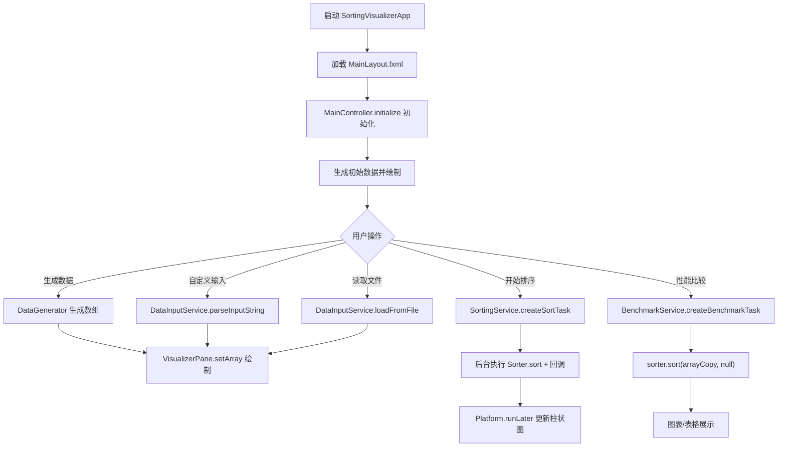
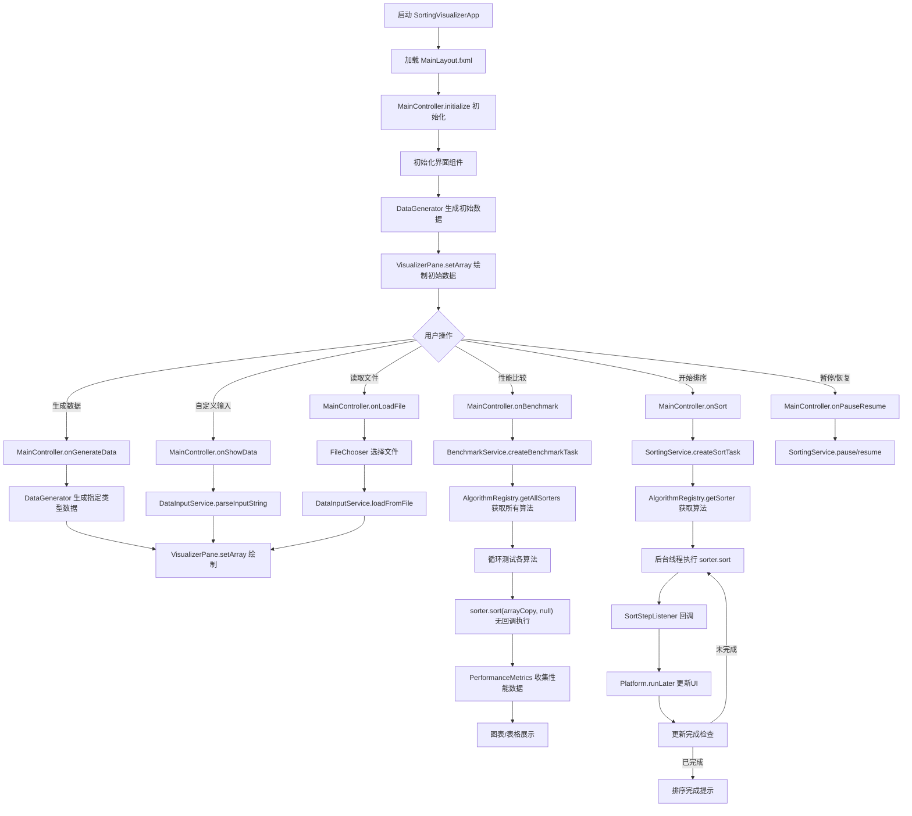
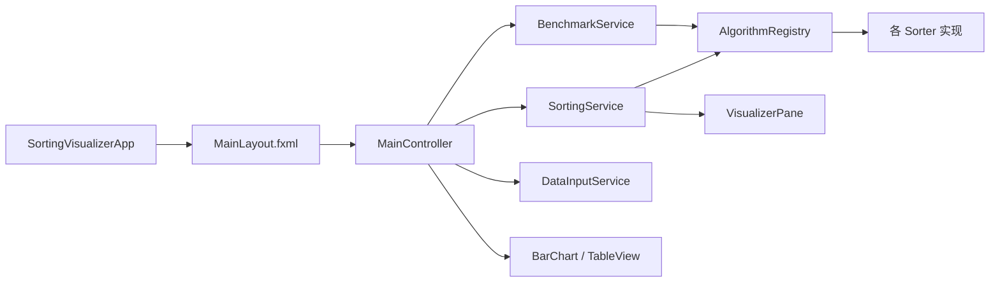
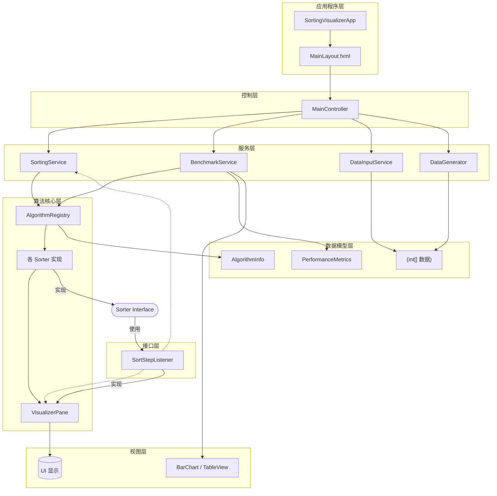
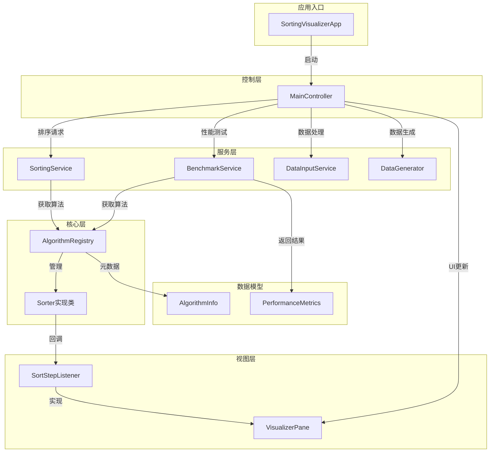
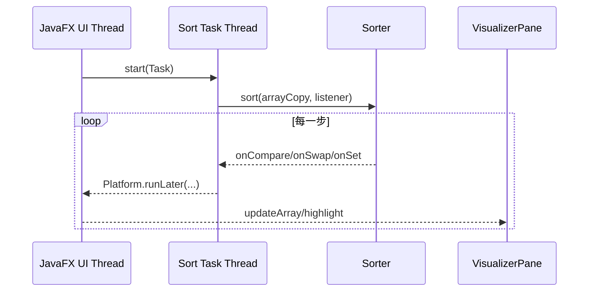

# 《数据结构与算法课程设计》

《数据结构与算法课程设计》
课程设计题目：排序算法性能比较与动画演示系统

项目名称：排序算法性能比较与动画演示系统  
开发语言：Java 17  
界面框架：JavaFX 17（FXML）  
构建工具：Maven  

---

## 1、问题描述

1）根据提供的题目要求，需要设计一个“排序算法性能比较与动画演示系统”，用于信息处理与算法学习场景下的排序过程演示与性能对比。系统以整数数组为对象，通过可视化方式展示排序过程中关键操作（比较、交换、覆盖写回）的变化过程，并提供多种排序算法在同一数据集上的性能比较结果。

2）在加强要求方面，系统需要实现更丰富的数据输入方式（生成数据、自定义输入、文件加载），实现动画交互控制（速度调节、暂停/继续），并在性能比较中给出除耗时外的对比信息（例如内存占用估算、复杂度与稳定性元数据展示）。

3）最终结果是一个桌面端 JavaFX 应用：能够生成/读取数组数据、选择算法进行动画演示，并能对多算法进行性能比较（以图表与表格形式输出）。

---

## 2． 需求分析

系统的基本功能：

1）数据准备：支持三种数据来源。
（a）生成数据：支持“随机数据 / 有序数据 / 逆序数据 / 部分有序”四种类型，数据量在界面输入框中给出（代码中生成时将数据量限制在 5~500）。
（b）自定义输入：在“自定义数据”文本框输入整数序列，支持空格/逗号/分号/制表符/换行等分隔符。
（c）文件读取：通过文件选择器加载 `.txt/.csv` 文件，读取内容后按同一解析规则转为数组。

2）动画排序：用户选择算法后点击“开始排序”，系统在后台线程执行排序，并在比较/交换/写回时更新界面柱状图；支持动画速度调节（滑块控制每一步的延迟），支持“暂停/继续”。

3）性能比较：点击“性能比较”后，对多种算法在同一数据集上进行基准测试（不启用动画回调），统计耗时与内存占用估算，并展示算法复杂度/稳定性元数据；程序会自动排除不适合做性能测试的演示型算法（猴子排序、睡眠排序、珠排序）。

输入/输出形式：

输入形式：

1）生成数据：在界面输入“数据量”，选择“数据类型”，点击“生成数据”。
2）自定义输入：在“自定义数据”文本框输入一串整数（例如：`3,1,4,1,5`），点击“显示数据”。
3）文件读取：点击“读取文件”，选择 `.txt/.csv` 文件。

输出形式：

1）动画演示输出：中间区域以柱状图形式显示数组，比较/交换/写回过程以高亮显示。
2）性能比较输出：显示三个 Tab：时间对比柱状图、内存对比柱状图（估算）、详细数据表（复杂度/稳定性等）。

测试数据要求：

1）生成数据：程序生成的数据为正整数序列（值域为 1~size）。
2）自定义/文件输入：需为可解析的整数序列；为了保证可视化柱状图显示效果，建议使用非负整数（输入负数可能导致柱高显示异常）。

---

## 3． 概要设计

（1）抽象数据类型：

ADT  待排序数据（数组）

Data
以 `int[]` 表示待排序数据。

Operation
generateData
前置条件：用户已输入数据量、选择数据类型
输入：size、type
功能：生成随机/有序/逆序/部分有序数组
输出：int []
后置条件：数组在界面中以柱状图显示

parseInputString
前置条件：用户已输入自定义字符串
输入：String input
功能：按多分隔符解析为整数数组
输出：int []
后置条件：数组在界面中以柱状图显示

loadFromFile
前置条件：用户已选择文件
输入：File file
功能：读取文件内容并解析为整数数组
输出：int []
后置条件：数组在界面中以柱状图显示

End ADT

ADT  排序算法（策略接口）

Data
各算法实现统一实现 `Sorter` 接口。

Operation
sort
前置条件：数组存在
输入：int [] array, SortStepListener listener
功能：对数组进行排序；listener 非空则上报步骤用于动画
输出：无
后置条件：数组变为非降序

End ADT

ADT  排序步骤监听器（动画回调）

Data
无

Operation
onCompare
前置条件：排序正在进行
输入：index1, index2
功能：表示比较两个下标的元素
输出：无
后置条件：界面高亮比较位置

onSwap
前置条件：排序正在进行
输入：index1, index2
功能：表示交换两个下标的元素
输出：无
后置条件：界面更新数组并高亮交换位置

onSet
前置条件：排序正在进行
输入：index, value
功能：表示覆盖写回（赋值）操作
输出：无
后置条件：界面更新数组并高亮写回位置

End ADT

（2）主程序流程：

图 1：主程序流程图

（3）模块调用关系

main（应用入口）：调用 FXML 加载与舞台展示。  
Controller（控制层）：处理按钮事件与界面状态。  
Service（服务层）：创建排序任务、创建性能测试任务、解析输入。  
Algorithm（算法层）：提供可插拔排序算法与元数据注册表。  
View（视图层）：柱状图绘制与高亮展示。

图 2：模块调用关系

---

## 4． 详细设计

（1）实现概要设计的数据类型：

1) 算法元数据与性能数据（Model）

`AlgorithmInfo` 记录算法名称、最好/平均/最坏时间复杂度、空间复杂度、稳定性等信息；`PerformanceMetrics` 记录单次测试结果（算法名、数据类型、数据规模、耗时纳秒、内存字节、算法元数据），并提供毫秒与 MB 的换算方法。

2）算法注册表（AlgorithmRegistry）

使用 `LinkedHashMap<String, Sorter>` 保存算法实例，使用 `LinkedHashMap<String, AlgorithmInfo>` 保存元数据，保证下拉框与表格展示顺序稳定。

3）可视化面板（VisualizerPane）

面板内部保存当前数组的保护性拷贝，通过重绘方式绘制柱状图。比较/交换/写回通过不同颜色高亮体现：

- 比较：红色
- 交换：绿色
- 写回：蓝色

（2）主程序以及主要模块的算法描述：

1) 控制器主逻辑（MainController）

当用户点击“开始排序”时：读取界面选择的算法名称，禁用部分控件防止重复操作，调用 `SortingService.createSortTask` 创建后台任务并启动线程执行；任务完成后恢复控件状态。

当用户点击“性能比较”时：从注册表获取算法列表并过滤掉不适合 benchmark 的演示型算法，调用 `BenchmarkService.createBenchmarkTask` 创建基准测试任务；任务完成后用 TabPane 展示时间图、内存图、详细表格。

2）动画排序服务（SortingService）

核心思想：后台线程执行排序，listener 回调中用 `Platform.runLater` 更新 UI，并在每步后按速度滑块设置的延迟进行 `Thread.sleep`；暂停/继续通过 `paused + wait/notifyAll` 实现。

图 3：动画回调时序（简化）

3）性能比较服务（BenchmarkService）

性能比较的关键点是：执行 `sorter.sort(arrayCopy, null)`，即不启用动画回调，从而尽量反映算法本身耗时。耗时用 `System.nanoTime()` 统计；内存占用为估算值，使用 `Runtime.totalMemory - freeMemory` 的差值计算。

4）数据输入服务（DataInputService）

自定义输入与文件读取共用同一解析逻辑：将换行规范化为空格，然后按 `[ ,;\t]+` 分隔符拆分为 token，再逐个 `Integer.parseInt`。

---

## 5、编码与调试分析

(1) 编码与调试过程中遇到的问题及解决办法：

【问题一】排序动画运行时 UI 卡顿或无响应

解决办法：排序不在 UI 线程执行，而是由 `SortingService` 创建 JavaFX `Task` 在后台线程运行，所有 UI 更新使用 `Platform.runLater` 切回 UI 线程。

【问题二】归并/计数/基数/桶排序等“覆盖写回型”算法难以用交换动画表达

解决办法：在系统中统一提供 `onSet(index, value)` 写回事件，并在回调中用蓝色高亮，保证这类算法也能逐步演示。

【问题三】性能比较中数据类型字符串不一致

解决办法：界面选项为“逆序数据”，性能模块历史分支存在“递序数据”拼写；已将性能模块兼容并统一支持“逆序数据”（并保留“递序数据”兼容分支），避免选择逆序时走到默认分支。

(2) 待解决问题（如无可填“无”）：

① （可选）自定义输入包含负数时柱状图显示可能异常，建议后续限制输入或对负值做归一化显示。

---

## 6、使用说明

1）运行项目

- Maven 编译：`mvn clean compile`
- 启动程序：`mvn javafx:run`

2）动画演示

- 选择排序算法、数据量、数据类型，点击“生成数据”。
- 点击“开始排序”观看动画。
- 使用“动画速度”滑块调节速度；点击“暂停/继续”控制演示。

3）自定义输入与文件读取

- 在“自定义数据”文本框输入整数序列，点击“显示数据”。
- 点击“读取文件”选择 `.txt/.csv` 文件。

4）性能比较

- 点击“性能比较”，系统会运行多算法基准测试并展示结果（时间图、内存图、详细表）。

---

## 7、测试结果

(1) 程序运行结果

图 4：程序运行截图（作者提供）

(2) 测试数据

图 5：测试数据截图（作者提供，可为随机/有序/逆序/部分有序中的一种）

(3) 性能比较结果

图 6：时间对比柱状图截图（作者提供）
图 7：内存对比柱状图截图（作者提供）
图 8：详细数据表截图（作者提供）

（说明：图 1~图 3 为本文 Mermaid 绘制的结构/流程图；图 4~图 8 为运行截图由作者补充。）

---

## 8、团队协作和自学内容

在课程设计过程中，围绕本项目主要自学与巩固了以下内容：

1) JavaFX：FXML 布局、控制器事件绑定、后台 Task 与 UI 线程协作。
2) 设计方法：MVC 分层、策略模式（`Sorter` 接口 + 多算法实现）、注册表模式（`AlgorithmRegistry`）。
3) 排序算法：快速/归并/堆等算法实现与可视化事件设计；理解稳定性与复杂度并在 UI 中呈现。

参考书/资料：
  [1] 《数据结构》相关教材（排序章节）
  [2] JavaFX 官方文档（Controls / FXML / Concurrency）
  [3] 《算法导论》排序相关章节

[1] Oracle. JavaFX 官方文档 [EB/OL]. https://openjfx.io/javadoc/17/, 2023.
[2] Maven Apache. Apache Maven Documentation [EB/OL]. https://maven.apache.org/guides/, 2023

---

## 附录：项目实施进度管理表

### 项目实施进度管理表（模板，按实际填写）

项目名称：排序算法性能比较与动画演示系统

项目负责人：____ ____ __    学号：__ ____ ____

同组姓名：____ ____ __  学号：__ ____ ____  
同组姓名：____ ____ __  学号：__ ____ ____  
同组姓名：____ ____ __  学号：__ ____ ____  

一、项目实施与合作交流内容

课设期间小组合作设计的具体实施方法：查阅资料与教材、讨论实现方法、梳理算法步骤与可视化事件、进行代码实现与联调、编写测试数据与报告等。

小组成员合作的具体做法：线上/线下沟通、分模块协作（算法实现、界面实现、性能比较、测试与文档），遇到问题及时同步并共同解决。

二、项目实施任务时间安排（模板，按实际填写）

阶段 | 实施时间 | 实施内容 | 完成情况及呈现形式
--- | --- | --- | ---
1 | ____-____ | 分析题目要求，讨论实现方法，初步建立代码框架 | 完成界面骨架与模块划分
2 | ____-____ | 实现核心排序算法并接入动画回调 | 动画演示可运行
3 | ____-____ | 完成性能比较模块与图表/表格展示，完善输入方式 | 对比结果可视化输出
4 | ____-____ | 调试优化，撰写报告与整理截图 | 可提交版本

项目负责人（签字）：____ ______

同组（签字）：____ ____ ____ ____ ____

年    月    日
